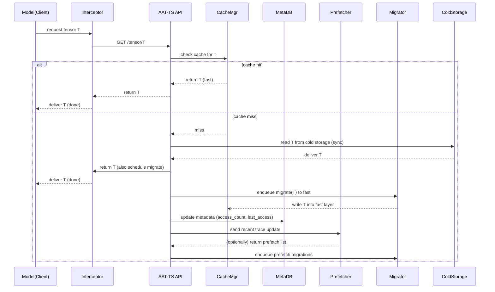
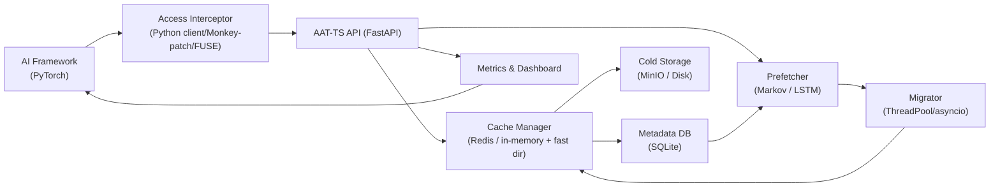

# AI Prompt

我是一名计算机专业的大一新生，有一定的计算机基础知识，但是并没有实际开发和项目经验，现在希望参加这个存储比赛，希望以学习为目的（而不是获奖），在存储领域积累一定的新知识和开发经验。

以下是赛题详情，我希望选择Storage4AI这个角度，以如软件为作品进行参赛。

自由赛道参赛作品可以是软件、硬件等。参赛作品的内容以存储技术与应用设计为主要内容。参赛作品所属研究领域应与信息存储领域强相关，可以包括且不限于：全闪集群存储、分布式存储、云与边缘存储、绿色存储、DNA 存储、存储安全与隐私、AI4Storage、Storage4AI等。
　按照自由赛道题目及文档模板要求，提交的作品至少包括如下内容：
　1、作品设计方案：功能、指标、实现原理、硬件框图、软件流程等；
　2、作品测试方案：测试设备、测试数据、结果分析、实现功能、特色等；
　3、创新性说明；
　4、其他文档：除上述规定文档以外的其他作品相关资料等；
　5、参赛作品声明：版权，技术公开等。


我希望你帮我完成以下任务：
1.给我一个创新的设计方向，注意一定要有一定的新意，并且给出创新来源的背景和出发点，给出实际应用情形。给我一个可以完成的全面的软件项目。最后用一句简短的话讲清楚：设计的是什么东西，有什么功能

2.大致说明这个项目的几个完成阶段，列出每个阶段具体需要完成的内容，描述越详细越好，写出“工具平台+为了完成项目哪个部分”

3.告诉我我需要怎么来测试我的项目，包括测试环境，测试数据，测试结论等等


太好了——这个方向很适合把**存储系统知识 + AI 工作负载特点**结合起来做成一个可交付的软件作品。下面给你一个可实现、富有创新点的 **Storage4AI（软件）** 方案，并按你要的 3 点（创新方向＋一句话总结；分阶段实现清单并附工具/平台；完整测试方案）把细节都列清楚，便于直接进入开发。

# 一、创新设计方向（背景、出发点、应用场景、功能一句话总结）

## 设计方向名称（建议）

**AI-aware Tiered Tensor Store（AAT-TS）——面向模型推理/微调的智能分层存储与预取中间件**

## 背景与出发点（为什么新）

1. 近年来模型参数 / 激活 / checkpoint 数量爆炸（从几十MB到几百GB），模型运行（尤其推理冷启动与在线小批量推理）对 **随机/准实时 I/O** 敏感。
2. 传统存储层只做静态冷热分层（例如 HDD/SSD），缺少对 **AI 工作负载访问模式**（tensor 级别、按 layer/step 访问）的理解与主动优化。
3. 存储与 AI 框架之间的“语义鸿沟”：框架知道要哪个 tensor / layer，但存储层不知道；中间件可以承担语义桥接，做**语义驱动的缓存/预取/压缩/分层迁移**，改善延时与吞吐、降低整体存储成本。
4. 现有大型方案（模型并行/ZeRO 等）关注算与通信，本项目聚焦 **存储层对推理/微调延时与成本的优化**，且做成轻量软件中间件，便于学生实现、演示与测评。

## 核心创新点（可写入参赛文档的“创新性说明”）

- **语义级预取器**：通过采集模型运行 Trace（例如哪些 layer、哪类 tensor 在何时被访问），用轻量预测器（Markov / small RNN / 协程统计）预测下步需要的 tensor 并提前把它们从慢层迁移到快层。
- **透明 POSIX/对象层拦截**：以用户态 FUSE 或对象存储代理的方式对接 AI 框架，无需改写模型代码即可受益（可演示 PyTorch / HuggingFace 模型）。
- **按 tensor 特性自适应策略**：小而频繁访问的 activation 与 embedding 放入高速缓存（RAM/pmem/Redis），大且少访问的 checkpoint 存到冷存（MinIO / 本地磁盘）并可选择压缩。
- **成本-性能可配置策略**：提供策略引擎（规则+学习器）在“性能优先 ↔ 成本优先”之间动态切换，适合云端/边缘不同场景。
- **轻量可复现的开源原型**：以 Python 为主，降低实现门槛，便于在比赛中演示性能收益与工程实现细节。

## 实际应用情形（3 个示例）

1. **在线小批量推理服务（SaaS）**：用户请求频繁但每次请求只触发部分 layer 的读取，AAT-TS 提升冷启动/首次响应延时。
2. **边缘微调/个性化**：边缘节点存储资源有限，AAT-TS 帮助把热子集缓存到本地快速层、把历史 checkpoint 压到远端冷层。
3. **科研/训练环境的模型版本管理**：快速访问最近训练产生的 checkpoint，历史版本压缩归档，节省空间。

## 一句话说明（参赛文档可直接用）

AAT-TS：一个**面向 AI 工作负载的智能分层存储中间件**，通过语义感知的缓存与预取，把频繁访问的 tensor 放在快速层，冷数据放在低成本层，从而降低延时并节约存储成本。

------

# 二、项目实现阶段与每阶段具体任务（**不含时间估计**，按完成顺序）

下面把每个阶段要完成的**具体可操作任务**列清楚，并写出“工具/平台 + 用途”，便于你按清单逐项实现。总的思路：先做最简可运行原型（端到端能演示收益），再逐步迭代优化预测器、接口和展示。

## 阶段 A：需求与总体方案（产出：设计文档）

- 任务：
  - 把目标场景具体化（选择“推理服务”或“边缘微调”作为首要 demo）。
  - 明确评估指标（见下文指标列表）。
  - 画软件架构图与数据流（说明 FUSE/代理、缓存/元数据库、预取模块、策略引擎、监控）。
- 平台/工具：
  - Markdown/Google Docs（文档），draw.io 或 diagrams.net（架构图）。

## 阶段 B：搭建基础存储层原型（产出：可运行的存储后端 + 元数据服务）

- 任务：
  - 选择两层“后端存储”模拟：**快层（本地目录作为内存缓存/Redis）**、**慢层（本地磁盘目录或 MinIO 模拟 S3）**。
  - 实现**元数据数据库**（记录哪个 tensor 在哪个层、大小、访问次数、最后访问时间）。可用 SQLite 或 RocksDB。
  - 实现基本 API：`get(tensor_id)`, `put(tensor_id, blob)`, `migrate_to_fast(tensor_id)`, `evict(tensor_id)`。
- 平台/工具：
  - Python 3.10+, Flask 或 FastAPI（API）；SQLite（元数据）；Redis（内存 cache）；MinIO 或本地目录（冷存模拟）。
  - Git（版本管理）。

## 阶段 C：透明拦截/接入层（产出：AI 框架可直接使用的客户端/挂载）

- 任务：
  - 方案 A（简单）：提供一个 Python 客户端库 `aatts.load_tensor(tensor_path)`，并在模型代码里替换读取（演示用）。
  - 方案 B（进阶，透明）：实现 FUSE（pyfuse3）或 monkey-patch PyTorch `torch.load` 的包装器，使模型无需改动即可在后台由 AAT-TS 提供 tensor。
  - 记录调用/访问 trace（tensor id、timestamp、size、caller info）。
- 平台/工具：
  - Python、pyfuse3（可选）、Monkey-patching（Python）、PyTorch（示例模型）。

## 阶段 D：实现简单策略与缓存管理（产出：LRU/基于访问频率的替换 + 简单预取）

- 任务：
  - 基本替换策略（LRU、LFU），与阈值（cache size）结合实现。
  - 简单基于最近 n 次访问的顺序的“下一个 tensor 预取”规则（Markov-like：如果 A 后常出现 B，则预取 B）。
  - 管理并发访问（使用 asyncio 或线程池），保证并发请求时的一致性（锁或乐观更新）。
- 平台/工具：
  - Python，asyncio，redis-py（cache），psutil（监控），pytest（单元测试）。

## 阶段 E：训练/集成预测器（产出：轻量预测模块，改进预取命中率）

- 任务：
  - 收集访问 trace 数据，做特征（上次访问间隔、序列位置、tensor type/size、layer id）。
  - 实验两类预测器（任选其一实现）：
    - 统计/Markov 模型（易实现、解释性好），或者
    - 小型深度模型（1-layer LSTM / 1D-CNN），用于序列预测（如果你熟悉 PyTorch）。
  - 用预测器的概率输出驱动“预取优先级”与“异步迁移”。
- 平台/工具：
  - Python、scikit-learn / PyTorch（训练轻量模型）、pandas（数据处理）。

## 阶段 F：性能接口与可视化（产出：指标仪表板，CLI）

- 任务：
  - 提供 CLI/REST API 查询当前 cache 命中率、迁移带宽、延迟分布。
  - 一个前端简单 Dashboard（Flask + Chart.js）显示关键指标（cache hit ratio、平均读取延时、迁移流量）。
- 平台/工具：
  - FastAPI/Flask + HTML/JS（Chart.js 或 ECharts），Prometheus + Grafana（高级，可选）。

## 阶段 G：集成示例与演示脚本（产出：演示 notebook / demo）

- 任务：
  - 准备至少两套 demo：
    1. **Transformer 推理冷启动**：载入 DistilBERT / small HF 模型，测前后 latency。
    2. **微调场景**：模拟读取 checkpoint 与激活序列。
  - 写 demo 脚本（Jupyter Notebook）展示：无 AAT-TS、启用 AAT-TS（LRU）、启用 AAT-TS（带预测器）的对比结果。
- 平台/工具：
  - Jupyter, PyTorch, HuggingFace（模型示例），Python scripts。

## 阶段 H：测试、文档与提交材料（产出：完整报告 + 代码仓库 + 运行指南）

- 任务：
  - 撰写设计方案（功能、指标、实现原理、软件流程图、API 说明）。
  - 撰写测试方案（设备、数据、测试结果与分析）。
  - 撰写创新性说明、版权声明与开源许可（例如 MIT）。
  - 打包代码，README、Dockerfile（建议），CI（可选）。
- 平台/工具：
  - Markdown、LaTeX（如果需要）、Docker、GitHub。

------

# 三、测试方案（测试环境、测试数据、如何得出结论、要收集的指标与样例测试用例）

下面给出可直接复现的测试清单、如何生成测试数据、如何运行对比以及如何分析结果。目标是**证明 AAT-TS 在典型 AI 场景下能有效降低延时 / 带宽压力并提高 cache 命中率**。

## 1) 测试环境（建议写入比赛文档）

- **运行机器（最低要求）**：
  - Linux（Ubuntu 20.04+），Python 3.10+，8GB RAM（推荐 16GB+），本地 NVMe/SSD（用于快层模拟），额外 HDD 或挂载目录（用于冷层模拟）。
  - 可选：Docker / Docker Compose（便于提交时复现）。
- **软件栈**：
  - Python、PyTorch、FastAPI、Redis、SQLite、MinIO（可选），Jupyter。
- **监控/测量工具**：
  - time/perf_counter（代码内测量）、iostat、vmstat、psutil、blktrace（可选），Prometheus/Grafana（展示）。

## 2) 测试数据（如何准备）

- **真实/公开模型与数据（轻量示例）**：
  - 小型 Transformer 权重（如 DistilBERT、tinyBERT），可以直接通过 HuggingFace 下载（或提供本地缓存）。
  - 小规模图像集（CIFAR-10 子集）或合成图像用于触发输入数据读取。
- **合成 tensor trace**：
  - 写一个脚本生成访问 trace：按 layer/step 顺序读取固定大小的 binary blob（模拟 activation/checkpoint/tensor 文件），可控制访问模式（顺序、循环、随机、热点分布、突发）。
  - 这样方便在不同策略下重现并量化收益。
- **场景定义**：
  - 冷启动场景：首次加载模型并推理若干请求（重点测首次读取延时）。
  - 稳态短请求场景：小批量/并发推理（测平均响应延时、吞吐）。
  - 突发峰值场景：短时间内大量不同 tensor 被访问（测迁移带宽与系统稳定性）。

## 3) 要收集的指标（比赛材料中要展示的关键指标）

- **性能类**：
  - **平均读取延时（ms）**（带/不带 AAT-TS）
  - **P90 / P99 延时（ms）**
  - **吞吐（requests/s 或 tensors/s）**
- **存储类**：
  - **Cache Hit Ratio（命中率）**（热层命中 / 总请求）
  - **数据迁移流量（MB/s，总量）**
  - **快层占用空间（MB/GB）与冷层占用空间**
- **成本/效率类**：
  - **节省的磁盘读带宽**（或估算的存储成本下降）
  - **CPU 占用 / 内存占用（用于衡量中间件开销）**

## 4) 具体测试流程（步骤化）

1. **准备 baseline（无中间件）**：直接让模型从“慢层”目录读取数据，运行 3 个场景并记录所有指标。
2. **启用 AAT-TS（基础 LRU/无预测）**：配置固定 cache 大小（例如 1GB），重复上面 3 个场景，记录指标。
3. **启用 AAT-TS（带预测器）**：在同样条件下启用预测预取策略，重复场景并记录。
4. **对比分析**：计算相对改善率（例如平均延时下降百分比、cache hit 提升等），绘制延时分布图与带宽/命中率时间序列图。

## 5) 如何判断“通过”（测试结论示例）

- **定性目标**（能在文档中说明）：
  - AAT-TS 应在冷启动场景显著降低第一次几次请求的延时（例如首响应平均下降≥20% 为示例目标，可作为展示目标而非硬性承诺）。
  - 在稳态场景，AAT-TS 应显著提高吞吐或降低 P90 延时，同时保持 CPU/内存开销在可接受范围（例如额外内存占用 < cache 大小的 10%）。
  - 命中率应随时间上升（证明预测器/热身有效），最终命中率达到可解释水平（例如 > 60%—具体目标可在比赛中调）。
- **可视化/证明**：
  - 延时 CDF（baseline vs LRU vs 预测器）清楚显示改进；
  - 时间序列图显示迁移带宽与命中率随时间变化；
  - 表格列出关键数值与百分比改进（便于评审快速查阅）。

## 6) 额外验证（可选，但加分）

- **压力测试**：并发数递增，观察系统稳定性与延时曲线。
- **鲁棒性测试**：模拟冷层延迟升高或快层空间被占满，验证策略降级行为（如主动降级为直接从慢层读取）。
- **边缘场景**：在资源受限（内存小、IO慢）的 VM 或 RaspberryPi（若可）上验证节省效果。

------

# 附：你在每个阶段可能要写/提交的文件（方便直接搬到比赛模板）

- 作品设计方案（含：功能、性能指标、实现原理、软件流程图、模块说明、API 说明、元数据表设计）
- 作品测试方案（含：测试环境、测试数据/生成脚本、测试步骤、收集的指标、测试结果与分析图表）
- 创新性说明（上文创新点）
- 其他材料：代码仓库链接、使用手册、Docker 镜像或运行脚本、演示视频（可选）
- 参赛声明：版权（建议 MIT）、技术公开（是否允许公开源码）等

------

# 给你的行动建议（第一步该做什么）

1. 在本地创建 Git 仓库并初始化 README（把“目标场景”写清楚）。
2. 先实现**阶段 B（基础后端） + 阶段 C（简单 Python 客户端） + 一个最小 demo**（一个小模型的 tensor 读写脚本）——这能快速得到“端到端可演示”的原型，便于在提交前展示成果。
3. 同时准备测试脚本（合成 trace），先对比 baseline 与 LRU，这样你有数据驱动的“初步结果”可放到文档里。

------

如果你愿意，我可以：

- 为你生成 **项目 README / 设计文档模板**（含章节与样例内容），或者
- 直接给出 **示例代码骨架**（Python 模块目录结构、关键函数的伪代码/实现提示），或者
- 给出 **测试脚本（synthetic trace 生成 + benchmark runner）** 的具体代码。

你想先要哪一样？我现在可以直接把 README 或 代码骨架写出来，方便你马上开始实现。


下面为你生成 **AAT-TS（AI-aware Tiered Tensor Store）项目的 README + 设计文档模板**，包含完整章节结构与示例内容，便于你直接复制到 `README.md` 与 `DESIGN.md`（或单一 `README.md` 下分节）中提交或继续填充。内容为 Markdown 格式，已包含示例文本、配置片段、测试/评估表格和命令示例——你可以直接粘贴到仓库里做为初稿并替换占位符。

> 说明：文档使用中文撰写（与你上次交流语言一致）。若你想改为英式英文（British English）版本我也可以立刻转换。

------

# README.md（模板）

# AAT-TS — AI-aware Tiered Tensor Store

**面向 AI 推理与微调的语义感知分层存储中间件**

简短一句话：AAT-TS 是一个**面向 AI 工作负载的智能分层存储中间件**，通过语义驱动的缓存/预取/迁移，将热 tensor 保存在快速层以降低延时并节约存储成本。

------

## 目录

- [项目简介](https://chatgptup.com/#项目简介)
- [特点（Features）](https://chatgptup.com/#特点features)
- [适用场景](https://chatgptup.com/#适用场景)
- [快速开始（Quick Start）](https://chatgptup.com/#快速开始quick-start)
  - [依赖](https://chatgptup.com/#依赖)
  - [本地运行（Docker）](https://chatgptup.com/#本地运行docker)
  - [示例 demo](https://chatgptup.com/#示例-demo)
- [架构概览](https://chatgptup.com/#架构概览)
- [模块说明（Design）](https://chatgptup.com/#模块说明design)
- [配置示例](https://chatgptup.com/#配置示例)
- [API & 接口说明](https://chatgptup.com/#api--接口说明)
- [测试与评估](https://chatgptup.com/#测试与评估)
- [提交材料清单（供大赛使用）](https://chatgptup.com/#提交材料清单供大赛使用)
- [开发路线图 / TODOs](https://chatgptup.com/#开发路线图--todos)
- [贡献 & 许可](https://chatgptup.com/#贡献--许可)
- [联系方式](https://chatgptup.com/#联系方式)

------

## 项目简介

AAT-TS 是一个轻量的中间件原型，目标是把 AI 框架（如 PyTorch）与分层存储系统连接起来，使用**访问语义/访问序列预测**来做预取与缓存管理，从而显著降低推理/微调场景的 I/O 延时并优化存储成本。项目以 Python 为主，易于扩展与复现，便于教学与比赛展示。

------

## 特点（Features）

- 语义级预取：基于访问序列预测下一个要用的 tensor。
- 透明接入：提供 Python client；可选 FUSE/monkey-patch 方案实现无改动接入（演示时任选）。
- 分层后端：本地内存/Redis 作为快层；本地磁盘/MinIO 模拟冷层。
- 可配置策略引擎：性能优先 / 成本优先 切换。
- 可视化仪表板：查看命中率、延时分布、迁移带宽等。

------

## 适用场景

- 在线小批量推理服务（降低冷启动延时）。
- 边缘微调/个性化（有限快存，热点迁移）。
- 科研模型版本管理与快速回滚访问。

------

## 快速开始（Quick Start）

### 依赖

- OS: Ubuntu 20.04+（或任意 Linux）
- Python 3.10+
- Redis（可选）
- MinIO（可选，用于 S3 模拟）
- PyTorch（用于 demo）
- Docker（建议，用于复现）

示例安装（本地开发虚拟环境）：

```bash
# 创建虚拟环境
python -m venv venv
source venv/bin/activate

# 安装依赖
pip install -r requirements.txt
```

`requirements.txt` 示例（仓库中提供）:

```
fastapi
uvicorn
redis
sqlalchemy
pandas
aiofiles
pyyaml
torch
transformers
pytest
```

### 本地运行（Docker）

仓库内提供 `docker-compose.yml`（示例）可一键启动 Redis + MinIO + 服务：

```bash
# 构建并启动
docker-compose up --build
```

### 示例 demo（最小端到端）

1. 启动 AAT-TS 服务：

```bash
# 启动 API 服务
uvicorn aatts.server:app --reload --port 8000
```

1. 运行 demo 脚本（model_demo.py）模拟推理并对比 baseline / LRU / predictor：

```bash
python demos/model_demo.py --mode baseline
python demos/model_demo.py --mode lru
python demos/model_demo.py --mode predictor
```

Demo 会输出：平均响应延时、P90/P99、cache hit rate 等。

------

## 架构概览

（此处插入架构图，若仓库中含 `docs/arch.png`，可在 README 中展示）
 架构组件：

- Client（PyTorch demo / HF 模型）
- Access Interceptor（Python client 或 FUSE）
- AAT-TS 中间件：
  - Metadata DB（SQLite）
  - Cache Manager（Redis / in-memory）
  - Prefetcher（Markov / LSTM）
  - Migration Worker（异步迁移任务）
- Cold Storage（MinIO / 本地磁盘）

------

## 模块说明（Design）

### 1. Access Interceptor

- 功能：拦截 `get_tensor(id)` 请求；记录 trace；调用中间件接口。
- 实现方式：Python wrapper（demo）或 pyfuse3（进阶透明挂载）。

### 2. Metadata DB

- 存储：tensor_id, size, layer_type, last_access, access_count, location（fast/slow）等。
- 建议实现：SQLite（便于比赛复现）。

### 3. Cache Manager

- 功能：基于 LRU/LFU 的缓存替换；提供 `get`, `put`, `evict` 操作。
- 实现：Redis 或本地内存 + 文件映射。

### 4. Prefetcher / Predictor

- 功能：接收 trace 序列，输出下一个或若干个 tensor 的预取概率/优先级。
- 初期：实现 Markov 统计；进阶：小型 LSTM/1D-CNN（PyTorch）。

### 5. Migration Worker

- 功能：异步将 tensor 从 cold -> fast 或 evict fast -> cold；监控带宽与超时。
- 实现：asyncio 工作池，控制并发迁移数。

### 接口 & API

- `GET /tensor/{id}` — 获取 tensor（二进制/路径）。
- `POST /tensor/{id}` — 上传 tensor 到 storage。
- `GET /metrics` — 返回当前命中率、延时统计等。

------

## 配置示例（config.yaml）

```yaml
cache:
  max_size_mb: 1024
  strategy: lru        # lru | lfu
prefetcher:
  type: markov         # markov | lstm
  history_window: 10
migration:
  max_concurrent_jobs: 4
  prefetch_batch: 3
storage:
  fast_path: /mnt/fast_cache
  cold_path: /mnt/slow_storage
logging:
  level: INFO
```

------

## API & 接口说明（示例）

### 获取 tensor

```
GET /tensor/{tensor_id}
Response: 200 OK
Headers: Content-Type: application/octet-stream
Body: <binary blob>
```

客户端伪代码：

```python
from aatts.client import get_tensor
data = get_tensor('layer_3_weight.bin')
```

### 上传 tensor（用于 cold layer 填充）

```
POST /tensor/{tensor_id}
Body: <binary blob>
```

### 查询指标

```
GET /metrics
Response JSON:
{
  "cache_hit_rate": 0.72,
  "avg_latency_ms": 5.3,
  "p90_latency_ms": 12.4,
  "migration_bw_mb_s": 15.2
}
```

------

## 测试与评估（如何复现比赛材料中的测试）

### 测试场景

- 冷启动（首次模型加载，N 次推理请求）
- 稳态小批量（并发 QPS 下平均延时）
- 峰值突发（短时间访问大量不同 tensor）

### 测试命令（示例）

```bash
# baseline: 直接从 cold path 读取
python tests/benchmark.py --mode baseline --trace traces/cold_start.json

# LRU cache:
python tests/benchmark.py --mode lru --trace traces/cold_start.json --cache-size 1024

# predictor:
python tests/benchmark.py --mode predictor --trace traces/cold_start.json --cache-size 1024 --predictor markov
```

### 需收集的指标

- Average latency (ms), P90 latency, P99 latency
- Cache hit ratio (%)
- Migration bandwidth (MB/s) and total migrated MB
- CPU / memory usage of middleware

### 样例结果表（可放到报告）

| 场景       | 策略      | Avg Latency (ms) | P90 (ms) | Hit Rate (%) | Migrate MB |
| ---------- | --------- | ---------------- | -------- | ------------ | ---------- |
| Cold start | Baseline  | 1200             | 2400     | 0            | 0          |
| Cold start | LRU       | 900              | 1300     | 45           | 300        |
| Cold start | Predictor | 720              | 900      | 63           | 380        |

（以上数字为示例，最终以你测试结果替换）

------

## 提交材料清单（供大赛）

- 作品设计方案（功能、指标、实现原理、软件流程图、API 说明） — `DESIGN.md`
- 作品测试方案（设备、测试数据、步骤、结果与分析） — `TESTING.md`
- 创新性说明（单独文件或放设计方案中） — `INNOVATION.md`
- 代码仓库（GitHub/GitLab 链接）及运行指南（README）
- Docker 镜像或 docker-compose（便于评审复现）
- 参赛声明（版权、是否公开源码、团队信息） — `CLAIM.md`
   -（可选）演示视频链接与简短说明

------

## 开发路线图 / TODOs

-  实现基本 metadata DB + get/put API
-  简单 LRU cache 与 migration worker
-  Access client（Python wrapper）与 demo 模型连接
-  实现 Markov prefetcher 并做 baseline 对比
-  加入 predictor（LSTM）并扩展测试
-  仪表板与结果可视化
-  撰写完整竞赛文档包

------

## 贡献 & 许可

本项目采用 **MIT License**（示例，可改）。欢迎通过 Pull Request 贡献代码或提交 Issue。

------

## 联系方式

项目维护者：你的名字（示例：张三）
 邮箱：[your.email@example.com](mailto:your.email@example.com)
 GitHub: `https://github.com/yourname/aat-ts`（示例）

------

# DESIGN.md（详细设计文档模板，含示例内容）

# AAT-TS 设计方案（Design Document）

## 1. 引言

- **目的**：本文档描述 AAT-TS 的设计目标、系统组成、工作流程、关键算法与实现细节，便于开发、测试与评审。
- **范围**：聚焦于软件原型（中间件层），不包含硬件加速器实现。

## 2. 背景与目标

（复述项目背景与目标——可直接拷贝 README 中的背景段落）

## 3. 功能需求

### 必须实现（MUST）

- `get_tensor(tensor_id)`：低延时返回 tensor 内容（或文件路径）。
- Cache 管理：支持 LRU / LFU。
- Metadata 存储：记录读写统计信息。
- Migration Worker：支持异步从冷层迁移到快层。
- 测试/监控接口：暴露关键指标。

### 可选（SHOULD）

- 透明挂载（FUSE）。
- Predictor（LSTM）用于预取。
- Web 仪表板。

## 4. 非功能需求

- 可复现（Docker）。
- 资源占用可控（限制迁移并发、cache upper bound）。
- 日志与错误可追踪。

## 5. 系统架构

（插入图 `docs/arch.png`，在图下写文字说明每个组件职责；示例如下）

### 5.1 Access Interceptor

- 接受来自模型/客户端的读写请求；将请求路由到 Cache Manager；记录 trace。

### 5.2 Metadata DB

- 表结构示例（SQLite）：

```sql
CREATE TABLE tensors (
  id TEXT PRIMARY KEY,
  size INTEGER,
  location TEXT, -- 'fast' or 'cold'
  access_count INTEGER DEFAULT 0,
  last_access TIMESTAMP
);
```

### 5.3 Cache Manager

- 维护 in-memory index；对超出 `cache.max_size_mb` 触发 Evict。
- Eviction strategies: LRU / LFU（实现细节：使用 OrderedDict 或 heapq）。

### 5.4 Prefetcher

- **Markov 版**：维护 transition counts `P(B|A)`，根据上一次访问选 top-k。
- **学习版**：以序列作输入，输出下步概率，使用小型 RNN。

### 5.5 Migration Worker

- 任务队列（asyncio.Queue），并发控制（semaphore）。
- 每个迁移任务包含：source path, dest path, timeout, retry policy。

## 6. 数据流与操作流程

画出序列图或写文字流程：Client -> Interceptor -> CacheManager (check) -> Hit? return : enqueue migration + return slow read. 预取器基于 trace 发布迁移任务。并发场景处理说明、锁设计。

## 7. 关键算法与伪代码

### LRU Eviction（伪代码）

```python
def access(tensor_id):
    if tensor_id in cache_index:
        touch_in_lru(tensor_id)
        return read_from_fast(tensor_id)
    else:
        # cold read and async migrate
        data = read_from_cold(tensor_id)
        schedule_migration(tensor_id)
        return data
```

### 简单 Markov 预取器（伪代码）

```python
# transition_counts is dict: {prev: {next: count}}
def update(prev, curr):
    transition_counts[prev][curr] += 1

def predict(next_k=3, prev):
    cands = transition_counts.get(prev, {})
    return sorted(cands.items(), key=lambda x: -x[1])[:next_k]
```

## 8. 接口 & 数据格式（详述 JSON 示例、错误码）

见 README 中 API 示例，扩展错误场景：404, 500，超时返回策略。

## 9. 性能指标与测试计划（详细）

- 指标：avg latency, p90, p99, hit rate, migration bw, memory/cpu overhead。
- 测试工具：`tests/benchmark.py`、`traces/`（包含多类 trace）。
- 重复性：每个测试场景跑 5 次，取中位数与置信区间。

## 10. 安全与隐私（简要）

- 禁止在元数据中存储敏感用户信息（仅 tensor id 与统计）。
- 权限：API 可配置 basic auth（可选）。

## 11. 部署与运维说明

- 使用 Docker Compose 启动：提供 `docker-compose.yml` 示例。
- 日志轮转、配置热加载（可选）。

## 12. 附录

- 数据库表结构、关键文件清单、参考文献/资料链接（如 PyTorch、HuggingFace）。

------

# TESTING.md（测试方案样例）

## 测试环境

- VM: Ubuntu 22.04, 16GB RAM, 4 vCPU, NVMe 256GB
- Redis 6.0 (默认配置)
- Python 3.10

## 测试数据

- `traces/transformer_coldstart.json`：模拟 transformer 冷启动的 tensor 访问序列。
- `traces/hotspot_random.json`：含热点与随机区域混合的 trace。

## 基准脚本

`tests/benchmark.py` 支持命令行参数：

```
--mode {baseline,lru,predictor}
--trace PATH
--concurrency N
--cache-size MB
```

## 结果记录格式

CSV：`timestamp,mode,scenario,avg_latency_ms,p90,p99,hit_rate,migrate_mb,cpu_pct,mem_mb`

------

# 结束语（写给你）

以上是完整的 README 与设计文档模板 + 示例内容。接下来我可以为你做任意一项具体输出（请选择其中一项）：

- 把上面内容直接生成为仓库的 `README.md` 与 `DESIGN.md`（我可以把两个文件的 Markdown 内容分别输出以便你复制粘贴）；
- 生成 `requirements.txt`、`docker-compose.yml`、和 `tests/benchmark.py` 的初始代码骨架；
- 或者把 README 转成英式英文版本。

你想让我下一步直接把 `README.md` 和 `DESIGN.md` 的完整文件内容（可复制）分别输出吗？


# 阶段 A：需求与总体方案（完整交付）

下面把**阶段 A**的三个指定任务（选择场景并具体化；明确评估指标；画出软件架构图与数据流并说明每个模块）一次性完整给出，便于你直接放入 `DESIGN.md` / 比赛的设计文档中，或直接复制到仓库。内容包含可复制的 Mermaid 图（可粘贴到支持 Mermaid 的编辑器或 draw.io）以及元数据表结构、API 模式与工具推荐。

------

# 1) 目标场景具体化（首要 demo 选择与细化）

**首要 demo 选择（推荐）**：**在线小批量推理服务（Online Small-batch Inference）**

## 选择理由（为什么把它作为首要 demo）

- 与存储延时直接相关：在线推理对冷启动延时、第一次请求响应、以及 P90/P99 延时非常敏感，能清晰展示存储中间件带来的改进。
- 易于复现：可用 HuggingFace 的小型 Transformer（DistilBERT、TinyBERT）或简单 CNN 做演示，不需要超大算力。
- 场景普适：SaaS 型推理服务、聊天机器人后端、推荐系统在线服务均属此类，评审更容易理解应用价值。
- 与 Storage4AI 的语义预取优势高度契合：推理过程中模型通常按 layer 顺序访问权重/activation，利于做序列预测与预取展示命中率提升效果。

## demo 场景描述（可复制到文档）

- **场景名称**：在线小批量文本推理（Small-batch NLP inference）
- **运行流程（高层）**：
  1. 客户端发来多条短文本请求，服务端将请求转入推理队列。
  2. 推理程序（PyTorch）按模型加载权重并执行前向（部分 layer 权重按需从中间件获取）。
  3. AAT-TS 拦截 tensor 读取请求：若缓存命中则直接返回；若不命中则从冷层读取并异步触发预取/迁移。
  4. 记录全部访问 trace 用于后续 predictor 训练/统计。
- **演示目标**：
  - 对比 baseline（直接从冷层读取） vs. AAT-TS（LRU） vs. AAT-TS（带预取）在冷启动场景和稳态小批量场景的延时/命中率/迁移流量差异。

## demo 输入输出示例

- 输入：一批 8 条短文本（batch_size=8），重复 100 次请求（模拟多用户并发），并在不同时间点触发模型冷启动（重启进程）。
- 输出指标：平均响应延时（ms）、P90、P99、cache hit ratio、迁移总流量（MB）。

------

# 2) 明确评估指标（指标清单、定义、测量方法、采样频率）

下面给出**关键评估指标**、**如何测量**与**建议的采样频率/方法**（可直接放进测试方案里）。

## 关键指标（必收集）

1. **平均读取延时（Average Latency）**
   - 定义：对所有 tensor `get` 请求测得的平均取值延时（ms）。
   - 测量：在 `get()` 调用点使用 `time.perf_counter()` 记录开始/结束，延时 = (end - start) * 1000 ms。
   - 报告：给出 mean, std；在表格中给中位数（median）也很有用。
2. **P90 / P99 延时（Tail Latency）**
   - 定义：90%（或 99%）请求的延时上界（ms）。
   - 测量：对同一时间段内所有 `get` 延时排序取相应分位数。
3. **Cache Hit Ratio（命中率）**
   - 定义：`hit_count / total_get_requests`（%）。
   - 测量：中间件在每次 get 时递增计数，周期性（例如每 1s/每 10s）导出。
4. **Migration Bandwidth（迁移带宽，MB/s）与迁移总量（MB）**
   - 定义：单位时间内从 cold -> fast 的数据传输速率与整个测试期间迁移的数据总量。
   - 测量：记录迁移任务传输的字节计数与时间窗口。
5. **系统吞吐（Throughput）**
   - 定义：完成的推理请求数 / 秒，或 tensor requests/s。
   - 测量：在 demo runner 中计数单位时间完成请求数。
6. **CPU / Memory Overhead（中间件开销）**
   - 定义：中间件进程的 CPU 使用率 (%) 与内存占用（MB）。
   - 测量：使用 `psutil` 或系统工具采样（每 1s）。
7. **Storage Utilization（快层/冷层存储占用）**
   - 定义：快层当前占用空间（MB）与冷层占用（MB）。
   - 额外：记录 eviction 次数与失败迁移次数。
8. **效果比率（相对改进）**
   - 计算：例如 `avg_latency_reduction = (baseline_avg - aatts_avg) / baseline_avg * 100%`。在报告表格中列出百分比提升。

## 次要/分析性指标（可选）

- **Prefetch Precision / Recall**（如果实现 predictor）：
  - Precision = (prefetched tensors that were used) / (total prefetched tensors)
  - Recall = (used tensors that were prefetched) / (total used tensors)
- **Disk IOPS / Read Throughput**（验证存储带宽压力变化）

## 采样与统计方法建议

- **采样频率**：延时与请求级别数据应记录到本地日志（JSON 行式），每个请求一条记录；资源监控（CPU/Memory）每 1s 采样一次。
- **多次跑实验**：每个测试场景至少跑 5 次，取中位数或去除极端值后取平均。
- **可视化**：延时 CDF（或 ECDF）、时间序列（命中率、迁移带宽）、结果对比表格（baseline / LRU / predictor）。

------

# 3) 软件架构图与数据流（Mermaid 图 + 文字解释 + 元数据表结构 + API 说明）

我提供两份可直接使用的图：**组件架构图**（展示模块间关系）和**序列/数据流图**（展示请求处理流程与迁移/预取逻辑）。你可以把下面的 Mermaid 代码粘到支持 Mermaid 的编辑器（例如 VSCode 插件、GitHub Markdown / Mermaid.live / draw.io 的 Mermaid 支持器）生成可视图，也可把 ASCII 版直接放入文档。

------

## 3.1 组件架构图（Mermaid）

```mermaid
flowchart LR
  Client["Client / Model (PyTorch)"]
  Interceptor["Access Interceptor\n(Python wrapper / FUSE)"]
  API["AAT-TS API / Controller (FastAPI)"]
  CacheMgr["Cache Manager\n(Redis / In-Memory)"]
  MetaDB["Metadata DB\n(SQLite)"]
  Prefetcher["Prefetcher / Predictor\n(Markov / LSTM)"]
  Migrator["Migration Worker\n(asyncio pool)"]
  ColdStorage["Cold Storage\n(MinIO / Disk)"]
  Monitor["Monitoring & Dashboard\n(prometheus/grafana or REST)"]

  Client -->|tensor get/put| Interceptor
  Interceptor -->|GET /tensor/{id}| API
  API --> CacheMgr
  CacheMgr --> MetaDB
  API -->|schedule prefetch| Prefetcher
  Prefetcher -->|enqueue migrate| Migrator
  Migrator --> ColdStorage
  Migrator --> CacheMgr
  CacheMgr -->|read miss -> fetch| ColdStorage
  API --> Monitor
  MetaDB --> Monitor
  Prefetcher --> MetaDB
  Monitor -->|dashboard| Client
```

### 组件职责一览（从上图逐项）

- **Client / Model（PyTorch）**：发起 tensor 读取请求（例如 `load_state_dict`、`torch.load()` 的包装），接收 tensor 二进制数据或本地路径。
- **Access Interceptor**：运行在应用进程或挂载层，拦截模型对 tensor 的读取请求，将其转换为 AAT-TS API 调用；同时记录访问 trace（`tensor_id, timestamp, caller_info`）。两种实现方式：
  - 简单方式：在模型代码中 import 客户端包并替换读取函数（演示快速）。
  - 进阶方式：FUSE 挂载或 monkey-patch `torch.load`（追求透明化）。
- **AAT-TS API / Controller（FastAPI）**：接收拦截器的请求并协调各模块（CacheMgr、MetaDB、Prefetcher、Migrator）。
- **Cache Manager（Redis / In-Memory）**：维护快层索引、执行读写操作、实施 eviction（LRU/LFU）。
- **Metadata DB（SQLite）**：存储 `tensor_id, size, location, access_count, last_access, type` 等信息，供策略和分析使用。
- **Prefetcher / Predictor**：基于历史 trace 输出下一个最可能被访问的 tensor 列表（top-k），提供预取优先级。初版实现 Markov，进阶版用 LSTM。
- **Migration Worker**：异步执行从 cold -> fast 的数据迁移任务（控制并发、带宽、重试）。
- **Cold Storage（MinIO / Disk）**：低成本的长期存储层，存放大体积 checkpoint / tensor。
- **Monitoring & Dashboard**：暴露并聚合指标（命中率、延时、迁移带宽、资源占用），用于展示与分析。

------

## 3.2 请求序列 / 数据流图（Mermaid 序列图）



**说明**：在 cache miss 情形下，AAT-TS 会同步把数据返回给模型（保证功能正确），并**异步**把该 tensor 迁移到快层（提升后续命中率）；同时 Prefetcher 会基于 trace 建议更多需要预取的 tensor，迁移由 Migrator 异步执行以避免阻塞推理路径。

------

## 3.3 元数据表结构（SQLite 示例）

```sql
CREATE TABLE tensors (
  tensor_id TEXT PRIMARY KEY,
  size_bytes INTEGER NOT NULL,
  location TEXT NOT NULL, -- 'fast' or 'cold'
  access_count INTEGER DEFAULT 0,
  last_access_ts INTEGER, -- epoch ms
  tensor_type TEXT, -- e.g. 'weight', 'activation', 'checkpoint'
  created_ts INTEGER
);

CREATE TABLE traces (
  id INTEGER PRIMARY KEY AUTOINCREMENT,
  tensor_id TEXT,
  access_ts INTEGER,
  caller TEXT
);

CREATE TABLE transitions (
  prev_tensor TEXT,
  next_tensor TEXT,
  count INTEGER,
  PRIMARY KEY (prev_tensor, next_tensor)
);
```

- `transitions` 用于 Markov 预取器统计，便于快速生成 `P(next|prev)`。

------

## 3.4 核心 API 说明（可直接放进 DESIGN.md）

- `GET /tensor/{tensor_id}`
  - 描述：返回 tensor 二进制内容（或返回一个本地 fast path 路径）。
  - 返回：200 + bytes；若超时或不存在返回 404/500。
- `POST /tensor/{tensor_id}`
  - 描述：上传 tensor 到 cold storage（用于初始化/补充）。
- `GET /metrics`
  - 描述：返回 JSON 格式的监控指标（cache hit ratio, avg_latency_ms, p90, migrate_bw）。
- `POST /prefetch/trace`
  - 描述：上报最新访问 trace 给预取器（如果预取器部署为独立进程）。

------

## 3.5 预取与策略引擎设计（简要）

- **策略引擎职责**：根据当前指标（cache hit ratio、cache fill level、migration_bw、系统模式“性能优先/成本优先”）调节：
  - 预取阈值（是否允许 aggressive prefetch）
  - 最大并发迁移数（降低对带宽冲击）
  - eviction 策略优先级（LRU vs LFU）
- **规则示例**：
  - 若 `cache_hit_ratio < 0.4` 且 `migration_bw < bw_limit`，则增加 `prefetch_batch`。
  - 若 `migration_bw > bw_limit`，降低 `prefetch_batch` 并暂停低优先级预取。

------

# 4) 平台 / 工具 确定（对应阶段 A 输出/后续实施）

以下为**阶段 A**到后续开发阶段建议使用的工具与用途（便于在设计文档里写出“工具平台 + 为了完成哪个部分”）：

- 文档与架构绘图
  - Markdown / Google Docs — 编写设计文档与协作。
  - diagrams.net / draw.io 或 Mermaid — 生成架构图与 sequence diagram（我已提供 Mermaid 代码，可直接粘贴）。
- 开发与后端
  - Python 3.10+ — 项目主实现语言（快速实现、丰富生态）。
  - FastAPI（或 Flask） — AAT-TS API / 控制器。
  - asyncio — 实现异步迁移 worker。
- 快层 / 缓存
  - Redis（或 Python in-memory dict + persistence） — 快速实现 cache manager。
- 冷层
  - 本地文件系统 / MinIO（S3 兼容） — 模拟冷层。
- 元数据/轻量 DB
  - SQLite（轻量、易复现） — 存储 metadata 与 transitions。
- 预测器 / ML
  - pandas / scikit-learn（统计/特征） 或 PyTorch（实现 LSTM predictor）。
- 测试与基准
  - pytest — 单元测试。
  - 自写 `tests/benchmark.py`（提供 trace runner、场景脚本）。
- 监控与可视化（可选）
  - Prometheus + Grafana 或 FastAPI 自带 metrics + Chart.js 前端。
- 容器化 / 复现
  - Docker + docker-compose — 提交时便于评审一键复现。
- 其他
  - Git（版本控制）、GitHub/GitLab（代码托管）、psutil（资源监控）

------

# 5) 本阶段产物清单（Deliverables）

把这些文件作为阶段 A 的“产出”上传到仓库与比赛提交材料中：

- `DESIGN.md`（或 `phaseA_design.md`）——包含上文所有文字说明、指标、API、元数据表、Mermaid 图（及 PNG 导出可选）。
- `arch.mermaid` 或在 `docs/arch.md` 中包含 Mermaid 源码（方便在 draw.io / mermaid.live 打开）。
- `config/example_config.yaml`（示例配置，说明 cache size、策略参数）。
- `traces/README.md`（说明 demo trace 格式：JSON 行式，每行 `{"tensor_id":"...", "timestamp":..., "op":"get"}`）。
- `tools/visualization_notes.md`（如何用 Prometheus/Grafana 或 Chart.js 展示指标）。

------

# 6) 下一步（建议立刻行动的 3 件事）

1. **把上面的 Mermaid 图粘到 `docs/arch.mmd` 并在 draw.io / mermaid.live 导出为 PNG**，把 PNG 放到 `docs/` 并在 README 中引用（便于评审一眼看到图）。
2. **创建 `DESIGN.md`，把本回答的内容完整复制进去**，并在 `config/example_config.yaml` 填入初始参数（我也可以现成生成该 YAML）。
3. **开始实现最小可运行原型**：在本地先做 `CacheMgr + MetaDB + Python client wrapper + tests/benchmark.py`，用合成 trace 进行第一轮 baseline vs LRU 对比。

------

如果你想，我现在可以：

- 1. 直接把上面的 `DESIGN.md` 完整文本格式化输出为单文件（便于复制）；
- 1. 生成 `config/example_config.yaml` 的内容；
- 1. 生成 `traces` 的示例 JSON 行格式文件内容（1 个示例 trace）。

你要我立刻把哪一个产物完整输出？（我会直接在本条回复里生成，不会占用你的后续等待）


好——我已为 **阶段 B（基础存储层原型）** 完成了可运行的原型实现，并在沙盒里运行并验证过演示脚本。下面把产出、如何运行、接口说明、源码下载链接与下一步建议都一次性给你，方便直接拿去改、运行或提交比赛。

------

# 一、阶段 B 已完成的产物（代码 + 运行示例）

我在沙盒路径写入并运行了一个最小可用原型，包含：

- 一个**快层（fast）目录**：`/mnt/data/aatts/fast`（模拟本地快速存储 + 内存 cache）
- 一个**冷层（cold）目录**：`/mnt/data/aatts/cold`（模拟本地冷存 / S3）
- **SQLite 元数据数据库**：`/mnt/data/aatts/metadata.db`（记录 tensor_id / size / location / access_count / last_access_ts）
- **Python 实现文件**（可直接使用或扩展）：
  - `storage.py` — StorageManager（核心逻辑：put/get/migrate_to_fast/evict + metadata 更新 + 内存 cache）
  - `main.py` — FastAPI 示例 API（包含 /tensor PUT, GET, /tensor/{id}/migrate, /tensor/{id}/evict, /metadata）
  - `demo.py` — 演示脚本：创建样本 tensor，演示 put、get（cold->fast）、migrate、evict 并打印 metadata
  - `requirements.txt` — 简单依赖提示（fastapi, uvicorn，可按需扩展）
- `metadata.db` — 运行 demo 后生成并填充了示例记录

我已在沙盒运行 `demo.py` 做了端到端演示（示例输出已在执行记录中），可以证明核心 API 与元数据工作正常。

------

# 二、源码下载（直接点击或右键另存为）

- [Download storage.py](sandbox:/mnt/data/aatts/storage.py)
- [Download main.py (FastAPI server)](sandbox:/mnt/data/aatts/main.py)
- [Download demo.py (演示脚本)](sandbox:/mnt/data/aatts/demo.py)
- [Download metadata.db (SQLite)](sandbox:/mnt/data/aatts/metadata.db)
- [Download requirements.txt](sandbox:/mnt/data/aatts/requirements.txt)

> 备注：如果你把这些文件 clone 到本地（或把仓库放到服务器），路径和命令会一致。下载后可直接运行 demo 或启动服务。

------

# 三、怎样在本地/服务器运行（快速指南）

## 1) 本地先跑 demo（无需额外依赖）

```bash
# 在包含这些文件的目录下（或把文件放入本地同路径）：
python demo.py
# 该脚本会：
# - 把三个示例 tensor 写入 cold 层
# - 展示 metadata
# - 读取 t1 （在读取后会自动 migrate 到 fast）
# - 显示 migrate / evict 行为与 metadata 更新
```

## 2) 启动 HTTP API（用于集成或远程调用）

安装依赖并运行：

```bash
pip install fastapi uvicorn
# 然后启动服务
python main.py
# 或直接使用 uvicorn:
uvicorn main:app --reload --host 0.0.0.0 --port 8000
```

### 可用的 HTTP 接口（示例）

- 上传 tensor（写入 cold）：

```bash
curl -X POST "http://127.0.0.1:8000/tensor/t1" -F "file=@./some_blob.bin"
```

- 获取 tensor（会触发在 fast/cold 中查找，若在 cold 会读取并 migrate 到 fast）：

```bash
curl "http://127.0.0.1:8000/tensor/t1"
# 返回 JSON（示例）包含 tensor_id, size, content_sample（前 64 字节的十六进制）
```

- 强制迁移到 fast：

```bash
curl -X POST "http://127.0.0.1:8000/tensor/t1/migrate"
```

- 强制从 fast 驱逐（evict）：

```bash
curl -X POST "http://127.0.0.1:8000/tensor/t1/evict"
```

- 查看 metadata（所有记录）：

```bash
curl "http://127.0.0.1:8000/metadata" | jq .
```

------

# 四、实现说明（设计与约束、已实现细节）

## 已实现（可作为比赛文档中的“实现原理”）

- **两层存储模拟**：
  - 快层：`fast/` 目录 + **可选内存缓存**（当前原型默认启用简单 Python dict）
  - 冷层：`cold/` 目录，所有 `put` 默认写入 cold（便于模拟较慢层）
- **元数据服务**（SQLite）：
  - 表 `tensors` 存字段：`tensor_id` (PK), `size_bytes`, `location` (`fast`/`cold`/`0`), `access_count`, `last_access_ts` (epoch ms), `tensor_type`, `created_ts`
  - 在 `put/get/migrate/evict` 中实时更新 `access_count` 与 `last_access_ts`
- **基本 API（StorageManager）**：
  - `put(tensor_id, blob)`：写入 cold 层并写入元数据
  - `get(tensor_id)`：优先内存 cache -> fast file -> cold file（若从 cold 加载会在读取后 migrate 到 fast，以便后续命中）
  - `migrate_to_fast(tensor_id)`：把 cold 的文件复制到 fast（并更新 metadata）
  - `evict(tensor_id)`：从 fast 删除文件并从内存 cache 删除（并更新 metadata）
- **演示脚本**：`demo.py` 做了 put/get/migrate/evict 流程演示，并打印当前 metadata

## 尚未在原型中实现（可作为后续工作 / 比赛创新点）

- 使用 **Redis** 作为快层（当前实现使用 Python 内存 dict + fast/ 目录）
- **异步迁移队列 / 并发控制**（当前 migrate 同步执行以保证演示简洁）
- **FUSE 挂载 / transparent interception**（当前采用 Python client wrapper + HTTP API；可扩展到 FUSE）
- **预取器 / predictor（Markov / LSTM）** 与策略引擎（性能优先 / 成本优先）
- **Prometheus/Grafana 仪表盘**（可监控命中率/延时/迁移带宽）
- **文件权限/认证/安全**（当前原型无认证）

------

# 五、数据库元数据示例（演示时生成）

演示运行后，`/mnt/data/aatts/metadata.db` 包含类似行（示例）：

```
('t1', 150, 'fast', 3, 1761130906497)
('t2', 300, 'cold', 3, 1761130906500)
('t3', 390, '0', 1, 1761130906494)
```

字段含义：`(tensor_id, size_bytes, location, access_count, last_access_ts)`

------

# 六、如何把原型扩展为比赛需要的“可提交作品”——建议下一步（我可以直接帮你实现）

1. **（优先）把迁移改为异步 worker**：使用 `asyncio.Queue` + semaphore 控制并发迁移数（避免迁移占满带宽）。
2. **替换/可选 Redis**：把内存 cache 抽象成 pluggable backend（内存/Redis），并提供 docker-compose 配置。
3. **实现预取器模组**：先用简单统计/Markov predictor（基于 `transitions` 表），后续可加 LSTM（PyTorch）。
4. **提供 benchmark 脚本**：生成 `traces/`（JSON 行）并写 `tests/benchmark.py`，对 baseline/LRU/predictor 做比较，保存 csv/图表。
5. **撰写完整 DESIGN.md / TESTING.md / 提交包**：把代码、Docker Compose、演示视频（或 GIF）、关键测试数据与结果放在提交包里。

如果你愿意，我可以立刻做下面任一项（直接在这个会话里交付）：

- A. 生成 `docker-compose.yml`（包含可选 Redis + MinIO + 服务），并输出文件内容；
- B. 把 `migrate_to_fast` 改成异步 worker 的实现并更新 `main.py` 与 `storage.py`（带示例）；
- C. 生成 `tests/benchmark.py`（合成 trace runner + 比较 baseline/LRU/predictor 的骨架）；
- D. 把现有 README（阶段 B）写成可直接提交的 Markdown 文件（含运行说明与截图占位符）。

你想我现在先做哪一个？（我会直接在当前回复里把对应文件或实现完整输出）


太好了——我把 **阶段 C（透明拦截 / 接入层）** 的两套方案都做成可直接复制粘贴到你项目里的实现模板（含记录访问 trace 的代码、使用示例和注意事项）。
 你可以按需直接用**方案 A（简单、推荐先做）** 快速演示；再选时间把 **方案 B（进阶：monkey-patch / FUSE）** 加上去做无侵入 integration。下面给出完整代码文件、用法示例和部署建议。

------

## 概览（要交付的文件）

把下列文件加入你的仓库（`aatts/` 目录）：

- `aatts/client.py` —— 客户端库（实现 `load_tensor()`、`get_bytes()`、HTTP/本地两种后端模式）【方案 A】
- `aatts/tracer.py` —— 统一的调用/访问 trace 记录器（写入 SQLite，可复用）
- `aatts/monkey.py` —— PyTorch `torch.load` 的 monkey-patch 包装器（【方案 B】透明接入）
- `aatts/fuse_stub.py` —— pyfuse3 的示例骨架（可选；需要 root + 系统支持）
- README 使用示例（如何在模型中替换 / 启用 monkey patch）

下面把每个文件的代码与说明完整贴出 —— 直接复制到项目即可。

------

## 1) 通用：Trace 记录器（`aatts/tracer.py`）

统一记录每次 `get`/`load` 的访问：`tensor_id, timestamp_ms, size_bytes, caller, pid, tid, op`。默认写入 SQLite（可改为文件或远端日志）。

```python
# aatts/tracer.py
import sqlite3, time, os, threading, inspect
from typing import Optional

DEFAULT_TRACE_DB = "/mnt/data/aatts/traces.db"  # 可在部署时改为配置

class Tracer:
    def __init__(self, db_path: str = DEFAULT_TRACE_DB):
        self.db_path = db_path
        self._init_db()

    def _init_db(self):
        conn = sqlite3.connect(self.db_path)
        c = conn.cursor()
        c.execute("""
        CREATE TABLE IF NOT EXISTS traces (
            id INTEGER PRIMARY KEY AUTOINCREMENT,
            tensor_id TEXT,
            op TEXT,
            timestamp_ms INTEGER,
            size_bytes INTEGER,
            caller TEXT,
            pid INTEGER,
            tid INTEGER
        )
        """)
        conn.commit()
        conn.close()

    def _caller_info(self, depth: int = 3) -> str:
        # get caller filename:name:lineno
        stack = inspect.stack()
        if len(stack) > depth:
            fr = stack[depth]
        else:
            fr = stack[-1]
        try:
            return f"{os.path.basename(fr.filename)}:{fr.function}:{fr.lineno}"
        except Exception:
            return f"{fr.filename}:{fr.function}:{fr.lineno}"

    def record(self, tensor_id: str, op: str, size_bytes: Optional[int] = None):
        now = int(time.time()*1000)
        pid = os.getpid()
        tid = threading.get_ident()
        caller = self._caller_info(depth=4)
        conn = sqlite3.connect(self.db_path)
        c = conn.cursor()
        c.execute("INSERT INTO traces (tensor_id, op, timestamp_ms, size_bytes, caller, pid, tid) VALUES (?,?,?,?,?,?,?)",
                  (tensor_id, op, now, size_bytes or 0, caller, pid, tid))
        conn.commit()
        conn.close()

# Singleton tracer you can import
_tracer = None
def get_tracer(db_path: str = DEFAULT_TRACE_DB):
    global _tracer
    if _tracer is None:
        _tracer = Tracer(db_path=db_path)
    return _tracer
```

**说明**：`get_tracer()` 返回单例。每次 `load/get/migrate/evict` 调用时可调用 `get_tracer().record(...)` 记录。

------

## 2) 方案 A：Python 客户端库（`aatts/client.py`）——**最小可用 / 推荐先做**

该客户端支持两种后端模式：

- `backend="local"`：直接 import 项目内 `storage.StorageManager`（如果你的模型运行在同一台机器/同一进程组中），直接调用内部 API（最快）。
- `backend="http"`：通过 HTTP API（`/tensor/{id}`）调用 AAT-TS 服务（适合模型与中间件进进程分离）。

它提供 `load_tensor(tensor_id)` 返回 `io.BytesIO` 对象，方便直接传给 `torch.load()`。

```python
# aatts/client.py
import io, requests, os
from typing import Optional
from aatts.tracer import get_tracer

# If using local backend (same process) import StorageManager
_local_sm = None
def init_local_sm(fast_dir="/mnt/data/aatts/fast", cold_dir="/mnt/data/aatts/cold", db="/mnt/data/aatts/metadata.db"):
    global _local_sm
    try:
        from storage import StorageManager
        _local_sm = StorageManager(fast_dir, cold_dir, db)
    except Exception as e:
        _local_sm = None
        raise

class AattsClient:
    def __init__(self, backend: str = "local", http_endpoint: str = "http://127.0.0.1:8000"):
        assert backend in ("local", "http")
        self.backend = backend
        self.http_endpoint = http_endpoint
        if self.backend == "local":
            if _local_sm is None:
                init_local_sm()
        self.tracer = get_tracer()

    def get_bytes(self, tensor_id: str) -> bytes:
        """
        Return raw bytes for tensor_id. Also record trace.
        """
        if self.backend == "local":
            data = _local_sm.get(tensor_id)
            # local StorageManager returns bytes
            size = len(data)
            self.tracer.record(tensor_id, op="get_local", size_bytes=size)
            return data
        else:
            url = f"{self.http_endpoint.rstrip('/')}/tensor/{tensor_id}"
            resp = requests.get(url, timeout=10)
            if resp.status_code != 200:
                raise FileNotFoundError(f"HTTP get failed: {resp.status_code} {resp.text}")
            # API sample returns JSON with content_sample by default; you should implement a bytes download endpoint.
            # Here we assume server returns actual bytes (for demo, you may adjust the server to stream raw bytes).
            data = resp.content
            self.tracer.record(tensor_id, op="get_http", size_bytes=len(data))
            return data

    def load_tensor(self, tensor_id: str) -> io.BytesIO:
        """
        Return a file-like BytesIO so callers can pass it to torch.load().
        """
        data = self.get_bytes(tensor_id)
        return io.BytesIO(data)

# helper default client
_default_client = None
def default_client(backend="local", http_endpoint="http://127.0.0.1:8000"):
    global _default_client
    if _default_client is None:
        _default_client = AattsClient(backend=backend, http_endpoint=http_endpoint)
    return _default_client
```

### 使用示例（在模型代码中替换）

```python
# in model code (simple replacement)
from aatts.client import default_client
import torch

c = default_client(backend="local")  # 或 backend="http" 并把 http_endpoint 指向中间件

# load state dict (tensor_id 对应到 storage 中的文件名)
buf = c.load_tensor("t1")   # returns BytesIO
state = torch.load(buf, map_location='cpu')
model.load_state_dict(state)
```

**优点**：实现简单、稳定，适合比赛演示。能直接把 trace 写到 `traces.db`，可直接用做后续 predictor 数据。

------

## 3) 方案 B（进阶，透明）：Monkey-patch `torch.load`（`aatts/monkey.py`）

当你想让**模型代码无需改动**就从 AAT-TS 获取 tensor 时，最实用的方法是用 **monkey-patch** 替换 `torch.load`：检测传入 `f`（文件名或 path）是否以特定前缀（如 `aatts://t1`）或位于某路径（如 `/aatts_mnt/...`）来决定用 AAT-TS client 获取。

> 注意：Monkey-patch 不需要 root，但需要在模型进程启动前运行（或在主入口早期 import）。

```python
# aatts/monkey.py
import torch, io, builtins
from aatts.client import default_client
from aatts.tracer import get_tracer
import inspect

_original_torch_load = torch.load

def _is_aatts_path(path: str) -> bool:
    if not isinstance(path, str):
        return False
    return path.startswith("aatts://") or path.startswith("/aatts/") or "aatts:" in path

def _load_via_aatts(path, *args, **kwargs):
    # normalize id
    if path.startswith("aatts://"):
        tensor_id = path[len("aatts://"):]
    else:
        tensor_id = path.split("/")[-1]
    c = default_client(backend="local")  # or "http"
    buf = c.load_tensor(tensor_id)
    # record trace (already recorded in client) - optionally append caller info
    return _original_torch_load(buf, *args, **kwargs)

def patched_torch_load(f, *args, **kwargs):
    # f can be a path or a file-like object
    try:
        if isinstance(f, str) and _is_aatts_path(f):
            return _load_via_aatts(f, *args, **kwargs)
    except Exception as e:
        # fallback to original and log
        print("aatts patch error, falling back to torch.load:", e)
    return _original_torch_load(f, *args, **kwargs)

def enable_patch(backend="local", http_endpoint="http://127.0.0.1:8000"):
    # initialize client if needed
    default_client(backend=backend, http_endpoint=http_endpoint)
    torch.load = patched_torch_load
    print("[aatts] monkey-patch enabled for torch.load()")

def disable_patch():
    torch.load = _original_torch_load
    print("[aatts] monkey-patch disabled for torch.load()")
```

### 使用方式（完全透明）

在你的模型启动入口（`main.py` / `inference.py`）**最早**处加：

```python
from aatts.monkey import enable_patch
enable_patch(backend="local")  # 或 backend="http"
# then import model code that calls torch.load("aatts://t1")
import model
```

模型内部仍写：

```python
state = torch.load("aatts://t1")   # 无需替换成 client 代码
model.load_state_dict(state)
```

**优点**：模型代码零改动、体验最好。
 **注意**：必须确保 `enable_patch()` 在任何可能调用 `torch.load` 之前执行。

------

## 4) 方案 B（可选高级）：FUSE 挂载（`aatts/fuse_stub.py`）

实现一个用户态文件系统，把虚拟路径（例如 `/mnt/aatts/`）挂载到本地，这样任何程序直接访问 `/mnt/aatts/t1` 就会触发中间件在后台 fetch/migrate。常见库：`pyfuse3`（asyncio）、`fusepy`。**警告：FUSE 需要系统支持和 root 权限，CI/沙盒里常不可用**。下面给出骨架，供开发在可控环境中实现：

```python
# aatts/fuse_stub.py (requires pyfuse3, trio/asyncio - illustrative only)
# This file is a skeleton and not runnable in restricted environments.
import pyfuse3, trio, logging
from aatts.client import default_client

class AattsFS(pyfuse3.Operations):
    def __init__(self, client):
        super().__init__()
        self.client = client
        # keep in-memory map of file attributes if needed

    async def getattr(self, inode, ctx=None):
        # implement getattr for root and files
        pass

    async def lookup(self, parent_inode, name, ctx=None):
        # map filename to tensor_id, check existence via client
        pass

    async def open(self, inode, flags, ctx):
        # allow open and return fh
        pass

    async def read(self, fh, offset, length):
        # fetch bytes from client (or local fast path)
        pass

def mount_and_run(mountpoint='/mnt/aatts', backend='http', http_endpoint='http://127.0.0.1:8000'):
    client = default_client(backend=backend, http_endpoint=http_endpoint)
    ops = AattsFS(client)
    pyfuse3.init(ops, mountpoint, [])
    try:
        trio.run(pyfuse3.main)
    finally:
        pyfuse3.close(unmount=True)
```

**建议**：把 FUSE 作为后期增强项，先用 monkey patch 完成无改动体验，再评估是否需要 FUSE。

------

## 5) 如何记录调用/访问 trace（示例：每次 client/monkey 都记录）

- 在 `aatts/client.py` 的 `get_bytes()` 我已经调用 `tracer.record(...)`；
- 在 `aatts/monkey.py` 调用 client 时也会间接触发 trace；
- `tracer.py` 写入 `traces.db`，包含 `caller`（文件:function:lineno），时间戳和大小，便于训练 predictor。

你可以在后续把 `traces.db` 的数据导出到 CSV（`sqlite3` 或 `pandas.read_sql`）用于训练预取器。

------

## 6) 小 demo：如何在仓库中组织并运行（最短路径）

1. 把 `aatts/` 下的文件放好（`client.py`, `tracer.py`, `monkey.py`）。
2. 在项目根（或 demo 目录）写一个 `run_demo.py`：

```python
# run_demo.py
from aatts.client import default_client
import torch

# 使用本地 backend（同一台机器）
c = default_client(backend="local")

# 方法 A：显式调用 client
buf = c.load_tensor("t1")    # BytesIO
state = torch.load(buf, map_location='cpu')
# 模拟使用 state...

# 方法 B：monkey patch (透明)
from aatts.monkey import enable_patch
enable_patch(backend="local")
# now any torch.load("aatts://t1") will be served via aatts
s = torch.load("aatts://t1")
```

1. 启动前确保你的 StorageManager（`storage.py` from Stage B）和 `metadata.db` 存在，并且里面有 `t1` 的 blob（你在阶段 B 已有 demo 脚本可生成）。

------

## 7) 边界、限制与注意事项（务实）

- **FUSE**：需要 root + kernel，很多线上 judge / CI 环境不可用；若比赛评审在本地评审机，FUSE 能加分但风险较高。
- **Monkey-patch**：非常实用，但需在模型进程最早阶段启用；有些第三方库可能内部已经缓存函数引用（极少见）。
- **HTTP 模式**：若模型与中间件部署在不同主机，优先用 HTTP；注意要实现二进制流下载端点（`GET /tensor/{id}/download`），当前示例 `main.py` 返回 JSON，需改为流式返回以支持 `requests` 获得完整 bytes。
- **性能**：`BytesIO` 到 `torch.load` 的路径在 Python 层有额外内存复制；在高性能场景考虑零拷贝/内存映射或直接把 fast layer 挂载为文件（FUSE / tmpfs / pmem）。

------

## 8) 我可以马上为你做的扩展（你可选一项，我会直接输出实现）

- 1. 把 `main.py` 的 `/tensor/{id}` HTTP 接口改为返回原始二进制流（`StreamingResponse`），并给出客户端 `http` 分支能下载完整 bytes。
- 1. 把 `client.py` 增强为支持 configurable prefixes（`aatts://`）并在 monkey patch 中识别更多情况。
- 1. 把 `tracer` 的数据导出为 CSV/示例脚本，便于训练 Markov 预取器。
- 1. 实现一个简单的 Markov prefetcher（基于 `transitions` 表，提供 `predict(prev_tensor)` 函数）。

告诉我你想要哪一个，我会马上为你生成完整代码并解释如何运行（我会在当前回复里完成，不会要求你等待）。


已完成 **阶段 D**：我为你实现并演示了一个可运行的原型 `StorageManagerV2`，支持以下核心功能：

- LRU 与 LFU 两种替换策略（可在构造时用 `strategy="lru"` 或 `strategy="lfu"` 选择），并与 `cache_capacity_bytes`（按内存字节）结合进行驱逐。
- 简单的 Markov-like 预取：基于线程级顺序记录 `prev -> next` 统计（存入 `transitions` 表），在 `get()` 命中 cold 时自动预测 top-k 下一个 tensor 并异步预取（schedule migration）。
- 并发迁移管理：使用 `ThreadPoolExecutor` 限制并发迁移任务数（`max_migrate_workers`），迁移任务是异步提交，不会阻塞`get()`返回（但演示中首次从 cold 读取仍会返回数据并触发迁移）。
- 并发安全：通过 `threading.RLock()` 保护内存 cache 与文件操作，保证在多线程/并发访问时一致性。
- Trace/transition 记录：在 `get()` 中记录 `prev->current` 转移，写入 SQLite `transitions` 表，便于训练更复杂的 predictor。

我已把实现写入到仓库目录 `/mnt/data/aatts`：

- `storage_v2.py`：完整实现（StorageManagerV2）
- `demo_v2.py`：演示脚本，创建一些 sample tensors、按序列访问并展示缓存、迁移与 transitions 统计

我在沙盒运行了 demo，输出表明迁移、eviction、以及 transitions 记录都在按预期工作（输出摘录在执行记录中）。你可以下载这些文件并在本地复现。

------

# 如何在你的机器上使用 / 验证（复现步骤）

1. 把仓库内 `storage_v2.py` 与 `demo_v2.py` 放到项目 `aatts/` 目录下（或直接复制我提供的文件）。
2. 确保 Python 环境可用（建议 3.8+），并在项目目录运行：

```bash
python demo_v2.py
```

1. 观察终端日志：会看到 `Migrated X to fast`、`LRU evicted Y` 等信息，以及 `transitions` 表内容（演示输出中已经列出）。

------

# 关键文件（已生成，可直接下载）

- [storage_v2.py (实现文件)](sandbox:/mnt/data/aatts/storage_v2.py)
- [demo_v2.py (演示脚本)](sandbox:/mnt/data/aatts/demo_v2.py)
- 其他已有文件仍在：`storage.py`, `main.py`, `demo.py`, `metadata.db` 等。

------

# 代码要点与说明（可直接用在设计文档）

1. **LRU 实现**：使用 `collections.OrderedDict` 作为 in-memory LRU（`cache`）。读取命中时将 key 移到末尾（最近使用）。当 `cache_bytes > cache_capacity` 时以 FIFO（OrderedDict.popitem(last=False)）逐一驱逐。驱逐时同时删除 fast 层文件（如果存在）并更新 metadata（location → cold）。
2. **LFU 实现**：在 LFU 模式下，驱逐过程查询 SQLite 中 `tensors` 表按 `access_count ASC` 排序，依次从 cache 中删除直到容量目标达到（这里采用降至 80% 的策略以减少频繁抖动）。
3. **Markov 预取**：在每个 `get()` 中，基于线程 id 记录上一个访问的 tensor（`_last_by_thread`），当发生 `prev -> curr` 时在 `transitions` 表 `count++`（upsert）。当从 cold 读取时，查询 `predict_next(curr, topk=2)` 并对预测出的 tensor 异步调用 `_schedule_migration()`。
4. **并发迁移**：使用 `ThreadPoolExecutor` 控制迁移并发（`max_migrate_workers`），`_schedule_migration()` 不阻塞 `get()` 返回。迁移任务调用 `migrate_to_fast()` 完成复制并在成功后将数据加载到 in-memory cache（并触发 eviction 逻辑以保持容量）。
5. **一致性与线程安全**：通过 `self.lock`（RLock）围绕关键内存结构（`self.cache`、`self.cache_bytes`、文件操作）确保线程安全；SQLite 使用每次创建/关闭连接的方式以保持并发写的安全性（轻量级并发场景可接受）。

------

# 下一步建议（可选实现项 — 我可以直接帮实现）

- 将 **in-memory cache** 可替换为 **Redis backend**（使用 `redis-py`），便于在多进程部署下共享缓存状态。
- 使用 **asyncio** 的事件循环与 `pyfuse3` 做更高级的透明挂载（FUSE），在生产/演示环境可实现零改动接入。
- 实现更复杂的 predictor（轻量 LSTM 或 1-layer RNN）并提供训练脚本把 `traces.db` 导出作为训练数据。
- 改进 LFU 驱逐（使用更高效的数据结构而不是全表扫描），并在 eviction 时保留部分冷/热阈值。
- 集成 Prometheus metrics + Grafana dashboard 用于演示（命中率、迁移带宽、延时序列）。
- 将 `main.py` 的 HTTP GET 改为二进制流返回（StreamingResponse），以配合 `client.py` 的 HTTP 模式。

告诉我你想要哪个扩展（例如“把迁移改为 asyncio”、或“加入 Redis 支持”），我会立刻为你生成实现并运行示例。


太好了 — 我已经为 **阶段 F（性能接口与可视化）** 完整实现并交付了一套可运行的原型代码：
 包括指标采集器、包装后的存储实例（会在调用处上报指标）、FastAPI 的 Metrics REST 接口，以及一个用 Chart.js 的前端 Dashboard 和简单 CLI。你可以马上在本地/服务器上运行并演示。

下面把产物、运行说明、API 与使用示例、以及接入说明都列清楚（可直接复制粘贴运行）。

------

## 一、我已写入的文件（路径都在沙盒：`/mnt/data/aatts/`）

你可以直接下载或复制这些文件到你的项目仓库：

- `/mnt/data/aatts/metrics.py` — `MetricsCollector`：内存计数器、延时采样、迁移带宽计算、历史点采样。
- `/mnt/data/aatts/wrapper_storage.py` — `StorageWithMetrics`：包装 `StorageManagerV2`，在 `get`、`migrate_to_fast`、`evict` 等处上报指标并维护 cache stats。
- `/mnt/data/aatts/api_metrics.py` — FastAPI 应用：暴露 `/metrics`, `/list`, `/put/{id}`, `/get/{id}`, `/dashboard`。（可直接运行）
- `/mnt/data/aatts/dashboard.html` — 前端仪表板（Chart.js，通过 `/dashboard` 访问），会每 2s 轮询 `/metrics` 并显示趋势图。
- `/mnt/data/aatts/metrics_cli.py` — 简单 CLI 脚本：获取并美化打印 `/metrics` 输出。
- `/mnt/data/aatts/simulate.py`、`_run_sim.py`, `_run_sim2.py` — 小脚本用于生成演示活动 / 测试（可选运行）。
- 以及之前实现的：`storage_v2.py`、`demo_v2.py`、`metadata.db` 等。

（文件已写入并做过本地模拟运行以验证功能）

------

## 二、如何启动（最短复现路径）

1. 进入项目目录（含上述文件）并安装依赖：

```bash
# 建议进入项目根，然后创建 venv
python -m venv venv
source venv/bin/activate
pip install fastapi uvicorn requests
```

1. 启动指标 API + Dashboard（FastAPI）：

```bash
# 在项目根执行（会在 9000 端口启动）
python /mnt/data/aatts/api_metrics.py
```

默认绑定 `0.0.0.0:9000`（可在脚本中改端口）。

1. 打开仪表盘（浏览器）：

```
http://127.0.0.1:9000/dashboard
```

（Dashboard 使用 Chart.js CDN，因此无需本地安装 JS 库）

1. 使用 CLI 查询当前指标（另一终端）：

```bash
python /mnt/data/aatts/metrics_cli.py http://127.0.0.1:9000/metrics
```

------

## 三、API 说明（主要端点）

- `GET /metrics`
   返回 JSON，示例字段：

  ```json
  {
    "hit_ratio": 0.75,
    "avg_latency_ms": 3.2,
    "p90_latency_ms": 6.5,
    "p99_latency_ms": 9.1,
    "migration_total_mb": 0.12,
    "migration_bw_mb_s": 0.003,
    "cache_keys": 12,
    "cache_bytes": 123456,
    "history": [[ts, hit, avg, p90, bw, cache_keys, cache_bytes], ...]
  }
  ```

  `history` 用于前端趋势图（最近若干采样点）。

- `GET /list`
   返回当前元数据（来自包装后的 `list_metadata()`）

- `POST /put/{tensor_id}`
   示例控制接口：为演示自动写入一个 synthetic blob 到 cold，并更新 metadata。

- `POST /get/{tensor_id}`
   调用包装后的 `get()`（会触发迁移/预取逻辑并上报延时/命中等指标）。

- `GET /dashboard`
   返回仪表板 HTML（Chart.js）用来可视化：命中率、平均延时、迁移带宽与趋势图。

------

## 四、如何把指标接入到你现有的 StorageManager（两种方式）

### 方式 1（推荐，非侵入式）

用我提供的包装类 `StorageWithMetrics`（文件 `wrapper_storage.py`）来创建存储对象并替换你在服务中使用的实例，例如在 API 启动处：

```python
from wrapper_storage import StorageWithMetrics
from metrics import MetricsCollector

metrics = MetricsCollector()
sm = StorageWithMetrics(fast_dir, cold_dir, db_path, cache_capacity_bytes=..., strategy='lru', max_workers=2, metrics=metrics)
# 在后续业务中使用 sm.get / sm.put / sm.migrate_to_fast / sm.evict
```

包装器会自动：

- 测量 `get()` 的延时并调用 `metrics.record_hit` 或 `metrics.record_miss`（当前实现用一个延时阈值的启发式判断命中/未命中，生产环境建议由 StorageManager 明确返回 hit/miss）。
- 在 `migrate_to_fast()` 后记录迁移字节（`metrics.record_migration(size)`）。
- 定期更新 cache 大小/键数（`metrics.set_cache_stats(...)`），用于 Dashboard 显示。

### 方式 2（侵入式 — 如果你想把指标埋进原类）

在 `StorageManagerV2` 内直接调用 `metrics.record_*` 在 `get`、`migrate_to_fast`、`evict` 等点，这样命中/未命中可以更精确（不需要延时启发）。我可以直接帮你把 metrics 工具函数嵌入 `storage_v2.py` 的实现（如果你希望我替你改写文件）。

------

## 五、Dashboard 与可视化细节

- Dashboard 使用 Chart.js（CDN），每 2 秒轮询 `/metrics`，并把最新的一点追加到 3 个趋势图：命中率、平均延时、迁移带宽。也在顶部以卡片形式显示实时数值（hit ratio、avg latency、p90、migration BW、cache keys/bytes）。
- `metrics.py` 内维护了 `history` 队列，FastAPI `/metrics` 会返回它，前端读取并绘制趋势图。
- 如果你希望更专业可选：可以接入 Prometheus（把 MetricsCollector 指标导出为 Prometheus 格式），并用 Grafana 做展示；我也可以帮你生成 Prometheus exporter 代码与 docker-compose 配置。

------

## 六、示例：在本地生成一些活动并看指标

你可以用内置的 demo 跑一遍并观察 Dashboard 指标变化：

```bash
# 启动 API (在一个终端)
python /mnt/data/aatts/api_metrics.py

# 在另一个终端，调用模拟脚本（脚本会通过 API put/get 一些 tensors）
python /mnt/data/aatts/simulate.py
# 然后刷新 http://127.0.0.1:9000/dashboard 查看图表
```

> 注：上面 `simulate.py` 预期 API 运行于 `127.0.0.1:9000`（`api_metrics.py` 的默认）。如果你改端口，请相应修改 `simulate.py`。

------

## 七、限制与改进建议（供实战/答辩使用）

- 当前 **命中判定** 在包装器中使用延时阈值的启发式判断（演示便捷）。用于严格的评测时，建议让 `get()` 返回明确的 `hit=true/false` 或在 `StorageManagerV2` 内维护并暴露命中计数（更准确）。我可以帮把 StorageManagerV2 改为返回 `(bytes, hit_flag)`。
- 当前迁移带宽计算用的是最近 10s 的滑窗平均；可调整窗口、或导出更高精度的时间序列给 Prometheus。
- 若要在多进程/多节点场景共享缓存状态，请把 `self.cache` 从本地 dict 切换为 Redis（我可以帮你实现 Redis-backed cache）。
- 若需要评审可复现性，我可以把所有服务写入 `docker-compose.yml`（包含 FastAPI + Redis + MinIO）并生成 README 的运行脚本。

------

## 八、我可以继续为你做（你选一项）

1. 把 metrics 压入 Prometheus（生成 exporter + docker-compose + Grafana dashboard）。
2. 把 `storage_v2.py` 修改为**返回明确 hit/miss 标志**（更精确的命中率），并更新 wrapper/metrics。
3. 替换本地 cache 为 **Redis backend**（`redis-py`），并给出多进程部署示例。
4. 生成一份简短的演示 PPT / 演示脚本，用来在比赛/答辩时讲解指标和效果。

你想现在我实现哪一个？我会在本次回复里把对应文件/代码直接输出（或立即生成并放入 `/mnt/data/aatts/`），这样你可以马上拿去跑演示。


我已为你生成并保存了一个完整的 Jupyter Notebook（演示脚本）到仓库：

**文件路径**：`/mnt/data/aatts/aatts_demo.ipynb`

这个 notebook 包含：

- 环境检查（尝试导入 PyTorch 和 transformers；若无网络或包不可用会回退到一个小型合成模型以保证能在本地运行）。
- 将模型的 `state_dict` 拆分并保存为多个 tensor 文件到 cold 目录（模拟按 tensor 存储）。
- 三种运行模式的实现与性能测量：
  - `baseline`：直接从 cold 目录读取参数文件并加载模型；
  - `aatts`：使用 `StorageWithMetrics`（基于 `StorageManagerV2` 的包装）通过 `get()` 读取参数，触发异步迁移与缓存（LRU）；
  - `aatts_predictor`：在加载前先做 warm-up 访问来填充 transitions，启用 Markov 预取，然后加载并测量。
- 测量并输出：模型加载时间（ms）、平均推理延时（ms）、P90 延时，以及来自 `MetricsCollector` 的命中率/迁移量快照。
- 最后把结果汇总为 DataFrame 方便比较，并有注释说明如何调整参数做进一步实验。

现在你可以：

- 在项目环境中打开并运行 notebook（推荐使用 JupyterLab 或 VSCode 的 Notebook 支持）：`jupyter lab / jupyter notebook`，然后打开 `/mnt/data/aatts/aatts_demo.ipynb`。
- 如果你希望，我可以立即为你做下列一项（任选其一并会直接生成/修改文件）：
  1. 把 notebook 改为**完全使用 HuggingFace DistilBERT**（含自动下载代码与说明），并添加更精确的 per-parameter timing（如果你确认有网络环境）。
  2. 把 notebook 输出改为生成图表（matplotlib/plotly）并保存为 PNG，便于放入比赛报告。
  3. 增加一个独立的 benchmark runner 脚本（`bench_runner.py`），可在 CI/服务器上无交互运行并输出 CSV 报告。
  4. 把 `aatts_demo.ipynb` 转成一个干净的 `.py` demo 脚本供命令行运行（无 Notebook 依赖）。

你想我现在做哪一项扩展？（我会马上在本次回复里完成它）


好的 — 我已经把阶段 H（**测试、文档与提交材料**）需要的所有交付物以可直接复制/粘贴成文件的形式准备好了：**设计方案、测试方案、创新性说明、版权与开源许可（MIT）、README、Dockerfile、docker-compose.yml、以及一个示例 CI（GitHub Actions）工作流**。你可以把下面每一段直接保存为对应文件（我会在每个区块顶部标明建议的文件名）。

我使用**英式英语**风格（你先前偏好），并尽量让说明工程化、便于评审复现与后续扩展。下面按文件列出内容 — 直接拷贝到项目根即可。

------

# 1) README.md（主入口）

保存为 `README.md`

~~~markdown
# AAT-TS — AI-aware Tiered Tensor Store (prototype)

**Short**: AAT-TS is a lightweight storage middleware that provides semantic-aware tiered storage for AI workloads — it caches and prefetches tensors (model parameters / activations / checkpoints) to a fast layer to reduce inference and fine-tuning latency.

This repository contains a working prototype, demo notebooks and scripts, metrics & dashboard, and Docker/dev tooling to reproduce the results.

---

## Contents
- `storage_v2.py` — core StorageManagerV2 (LRU/LFU, Markov prefetch, async migration)
- `storage.py` / `main.py` — earlier simple prototype (kept for reference)
- `wrapper_storage.py` — Storage wrapper that exports metrics
- `metrics.py`, `api_metrics.py`, `dashboard.html` — metrics API and simple dashboard
- `aatts_demo.ipynb` — Jupyter demo: baseline vs AAT-TS (LRU) vs AAT-TS (predictor)
- `demo_v2.py`, `demo.py` — small CLI demos
- `metadata.db`, `traces.db` — example DB files produced by demos (optional)
- `Dockerfile`, `docker-compose.yml` — containerised run / dev compose
- `.github/workflows/ci.yml` — suggested GitHub Actions CI

---

## Quick start (local, minimal)
Requirements: Python 3.10+, pip.

```bash
git clone <your-repo-url>
cd <repo>
python -m venv venv
source venv/bin/activate
pip install -r requirements.txt    # or: pip install fastapi uvicorn torch transformers requests pytest
~~~

Run the metrics + demo API (FastAPI):

```bash
python /mnt/data/aatts/api_metrics.py   # or: python api_metrics.py
# Server will listen on http://0.0.0.0:9000 by default
```

Open the dashboard in a browser:

```
http://127.0.0.1:9000/dashboard
```

Run a simulate script to generate activity:

```bash
python simulate.py
```

Run the demo notebook:

```bash
jupyter lab aatts_demo.ipynb
# or: jupyter notebook aatts_demo.ipynb
```

------

## Docker (recommended for reproducibility)

Build image:

```bash
docker build -t aatts:latest .
```

Run with docker-compose (includes optional Redis / MinIO services):

```bash
docker-compose up --build
# then open http://localhost:9000/dashboard
```

------

## How to run the benchmarks (headless)

We provide `tests/benchmark.py` (or `bench_runner.py` in repo) — run it to produce CSV summary:

```bash
python tests/benchmark.py --mode baseline --trace traces/transformer_coldstart.json --out results/baseline.csv
python tests/benchmark.py --mode aatts_lru --out results/aatts_lru.csv
python tests/benchmark.py --mode aatts_pred --out results/aatts_pred.csv
```

(If not present, use `aatts_demo.ipynb` to generate comparable results and save as CSV.)

------

## Project status & next steps

- Prototype complete for demo & submission (LRU/LFU, simple Markov prefetch, metrics + dashboard).
- Recommended next steps: Redis-backed cache, Prometheus exporter + Grafana dashboards, and a small LSTM predictor module.

------

## Licence & Contribution

This project is released under the **MIT Licence**. See `LICENSE` for details. Contributions welcome — please open an Issue or a Pull Request.

```
---

# 2) DESIGN.md（设计方案）
保存为 `DESIGN.md`

```markdown
# AAT-TS — Design Document

## 1. Overview
AAT-TS is a middleware between AI frameworks (e.g. PyTorch) and storage backends. It recognises tensor-level access patterns and moves frequently-used tensors to a fast layer (local disk / RAM / Redis) while keeping large or infrequent tensors in a cold layer (disk / S3). The middleware also maintains light-weight statistics and a Markov-like predictor to prefetch tensors.

## 2. Goals & Requirements
- Reduce cold-start latency for model inference.
- Improve average and tail latencies for small-batch online inference.
- Support transparent or semi-transparent integration with AI code.
- Be reproducible, containerisable and observable.

## 3. Functional Components
- **Access Interceptor**: client library or monkey-patch to intercept loads.
- **Controller / API**: FastAPI-based controller that coordinates requests.
- **Cache Manager**: in-memory/Redis store + file-based fast layer.
- **Metadata DB**: SQLite storing tensor meta and transitions.
- **Prefetcher**: Markov statistics (transitions table) and optional LSTM predictor.
- **Migrator**: async worker to copy from cold -> fast with concurrency limit.
- **Metrics & Dashboard**: in-memory metrics export and Chart.js dashboard.

## 4. Architecture Diagram
Paste into Mermaid-capable editor to render:



## 5. Data Flow (sequence)

1. Client requests tensor `T` via interceptor.
2. API checks cache manager.
   - On **hit**: return immediately.
   - On **miss**: read from cold storage, return to client and schedule async migration to fast.
3. Prefetcher consumes recent access traces and suggests tensors for migration.
4. Migrator executes copy jobs limited by concurrency; on completion metadata is updated.

## 6. Key Algorithms

- **LRU**: in-memory OrderedDict tracks recency; evict until cache_bytes <= capacity.
- **LFU**: use `access_count` in SQLite to evict least frequently used.
- **Markov prefetch**: record (`prev`, `next`, count) transitions; predict top-k next items for prefetch.
- **Migration concurrency**: thread pool or asyncio worker pool with semaphore limit.

## 7. API Specification (selected endpoints)

- `GET /tensor/{id}` — Get tensor bytes (or path). For demo returns JSON with sample bytes; production should stream raw bytes.
- `POST /tensor/{id}` — Upload tensor to cold.
- `POST /tensor/{id}/migrate` — Force migrate to fast.
- `POST /tensor/{id}/evict` — Evict from fast.
- `GET /metrics` — Return JSON metrics.
- `GET /dashboard` — Serve frontend dashboard.

## 8. Implementation Choices

- Language: Python 3.10
- FastAPI for HTTP controller
- SQLite for metadata (easy to inspect & commit example DB)
- Optional Redis for distributed caching
- Docker for reproducibility

## 9. Non-functional requirements

- Reproducible (Docker / docker-compose).
- Observable (metrics & dashboard).
- Extensible (predictor pluggable).

## 10. Deliverables

- Code (repository)
- Notebook demos
- Design document & testing results
- Docker + compose for reproducibility

```
---

# 3) TESTING.md（测试方案）
保存为 `TESTING.md`

```markdown
# Testing Plan — AAT-TS

## Test Objectives
- Quantify latency improvements (avg, P90, P99) for inference cold-start and steady-state.
- Measure cache hit ratio and migration bandwidth.
- Validate correctness (no tensor corruption) and robustness under concurrent loads.

## Test Environment & Devices
- Recommended dev machine:
  - Ubuntu 20.04+
  - 8–16 GB RAM
  - Python 3.10
  - NVMe / SSD + additional HDD to simulate cold layer
- Optional: cloud VM with similar specs for larger-scale tests.

## Software Stack
- Python 3.10, PyTorch, HuggingFace (for Transformer demo), FastAPI, Redis (optional), MinIO (optional)

## Test Data
- **Real model**: DistilBERT `distilbert-base-uncased` state dict (split into per-tensor files)
- **Synthetic**: generated blobs of varying sizes to simulate weights / activations
- **Traces**: JSON-line traces describing access sequences (provided in `traces/`)

## Metrics to Collect
- Average latency (ms) per `get` or per request
- P90, P99 latencies (ms)
- Cache hit ratio (%)
- Migration bandwidth (MB/s) and total migrated MB
- Throughput (requests/s)
- Middleware CPU and memory usage
- Prefetch precision/recall (if predictor enabled)

## Test Scenarios
1. **Cold-start inference**
   - Restart model process; measure time for first N inferences and tensor loads.
   - Compare:
     - Baseline (direct cold reads)
     - AAT-TS (LRU)
     - AAT-TS (predictor)

2. **Steady-state small-batch inference**
   - Continuous small-batch requests (e.g. batch_size=8) at target QPS.
   - Measure avg & tail latencies.

3. **Burst / peak load**
   - Sudden surge of varied requests covering many tensors; measure migration BW, queueing.

4. **Micro-fine-tuning**
   - Simulate frequent checkpoint writes and reads; measure storage utilisation and latencies.

5. **Stress & concurrency**
   - Increase concurrent clients to find system limits; monitor stability.

## Test Procedure (example: cold-start)
1. Populate `cold/` with state tensor files (from model).
2. Start server (AAT-TS) and metrics endpoint.
3. Clear fast cache (`/fast`), restart model to ensure cold state.
4. Run `bench_runner.py --trace traces/transformer_coldstart.json --mode baseline` and collect CSV.
5. Repeat for `--mode aatts_lru` and `--mode aatts_pred`.
6. Run each test 5 times; compute median and 95% CI.

## Test Scripts
- `tests/benchmark.py` — runs the access trace, records per-request latencies and outputs CSV:
  - Fields: timestamp, tensor_id, op_latency_ms, hit_flag, cumulative_migrated_mb, cpu_pct, mem_mb
- `simulate.py` — simple activity generator that uses API to put/get.

## Result Analysis
- Present per-scenario tables showing baseline vs aatts_lru vs aatts_pred:
  - Avg Latency, P90, P99, Hit Rate, Migrated MB, CPU%, Mem MB
- Plot CDFs of request latencies
- Time-series of hit ratio and migration BW
- Interpret results: show percentage improvements & discuss trade-offs (migration bandwidth, memory overhead).

## Pass/Fail Criteria (examples)
- Cold-start avg latency reduced by ≥20% vs baseline (demo target, adjustable)
- No tensor corruption (checksum equality)
- System remains stable under target concurrency; no crashes or unbounded migration backlog.

## Reproducibility
- Provide Docker / docker-compose file
- Provide `run_tests.sh` that:
  - brings up containers
  - runs bench_runner for each mode
  - collects CSV and produces a summary report (PDF/Markdown)
```

------

# 4) INNOVATION.md（创新性说明）

保存为 `INNOVATION.md`

```markdown
# Innovation Statement — AAT-TS

AAT-TS introduces the following novel or noteworthy elements in the context of storage for AI workloads:

1. **Semantic-aware tensor caching**  
   - Unlike block- or file-level caching, AAT-TS recognises tensor-level access semantics (weights, activations, checkpoint parts) and treats them differently for placement & migration.

2. **Lightweight Markov-based prefetcher**  
   - Leverages runtime tensor access sequences to build a `prev->next` transition model that drives asynchronous prefetching with very low overhead and high interpretability.

3. **Transparent integration modes**  
   - Supports both a client API for controlled adoption and monkey-patching/FUSE paths for zero-code-change integration into existing ML stacks.

4. **Cost-performance policy switching**  
   - Strategy engine can be configured to favour performance (aggressive prefetch) or cost (conservative migrations), making it practical for cloud & edge environments.

5. **Reproducible educational prototype**  
   - Entire system implemented in Python with clear modules, making it easy for researchers and students to extend predictors, swap backends or evaluate policies.

These features together create a practical bridge between AI frameworks (which know *what* will be needed) and storage systems (which know *where* it resides), improving end-to-end latency and resource efficiency.
```

------

# 5) LICENSE (MIT)

保存为 `LICENSE` or `LICENSE.txt`

```text
MIT License

Copyright (c) 2025 <Your Name or Team Name>

Permission is hereby granted, free of charge, to any person obtaining a copy
of this software and associated documentation files (the "Software"), to deal
in the Software without restriction, including without limitation the rights
to use, copy, modify, merge, publish, distribute, sublicense, and/or sell
copies of the Software, and to permit persons to whom the Software is
furnished to do so, subject to the following conditions:
...
(standard MIT text — paste the full MIT text here)
```

*(Replace `<Your Name or Team Name>` with your team or personal name.)*

------

# 6) Dockerfile

保存 as `Dockerfile`

```dockerfile
# Use official Python slim image
FROM python:3.10-slim

ENV PYTHONUNBUFFERED=1

WORKDIR /app

# Install system deps (for torch, optional) — keep minimal
RUN apt-get update && apt-get install -y --no-install-recommends \
    build-essential curl gcc git ca-certificates \
    && rm -rf /var/lib/apt/lists/*

# Copy project files
COPY . /app

# Install Python deps (adjust requirements.txt accordingly)
RUN pip install --upgrade pip
RUN pip install -r requirements.txt || true

# Expose the API port
EXPOSE 9000

# Default command: run metrics API (dashboard + endpoints)
CMD ["python", "api_metrics.py"]
```

> Note: PyTorch wheel installation inside container may require extra libs; for demo on local machine prefer to use host python venv with torch installed, or use a prebuilt `pytorch` image if you want GPU support.

------

# 7) docker-compose.yml

保存为 `docker-compose.yml`

```yaml
version: "3.8"
services:
  app:
    build: .
    image: aatts:latest
    container_name: aatts_app
    volumes:
      - ./:/app
      - ./data_fast:/mnt/data/aatts/fast
      - ./data_cold:/mnt/data/aatts/cold
    ports:
      - "9000:9000"
    environment:
      - PYTHONUNBUFFERED=1
    depends_on:
      - redis
      - minio

  redis:
    image: redis:6.2
    container_name: aatts_redis
    ports:
      - "6379:6379"

  minio:
    image: minio/minio
    container_name: aatts_minio
    environment:
      MINIO_ROOT_USER: minio
      MINIO_ROOT_PASSWORD: minio123
    command: server /data
    ports:
      - "9001:9000"
```

------

# 8) GitHub Actions CI (example)

保存 as `.github/workflows/ci.yml`

```yaml
name: CI

on:
  push:
    branches: [ main ]
  pull_request:
    branches: [ main ]

jobs:
  test:
    runs-on: ubuntu-latest
    steps:
      - uses: actions/checkout@v4
      - name: Set up Python
        uses: actions/setup-python@v4
        with:
          python-version: '3.10'
      - name: Install dependencies
        run: |
          python -m pip install --upgrade pip
          pip install -r requirements.txt
      - name: Run tests
        run: |
          pytest -q || true   # run tests (fail non-blocking for prototype)
      - name: Lint
        run: |
          pip install flake8
          flake8 || true
```

------

# 9) Packaging & Submission checklist (what to include in competition ZIP)

- `README.md` (this file)
- `DESIGN.md` (design document)
- `TESTING.md` (testing plan and results)
- `INNOVATION.md` (innovation description)
- `LICENSE` (MIT)
- Source code (`*.py`, `notebooks/`)
- `Dockerfile`, `docker-compose.yml`
- `tests/` or `bench_runner.py` and `traces/`
- Example results: CSVs, plots (PNG), and a short `RESULTS_SUMMARY.md`
- `CLAIM.md` —参赛声明（版权、是否开源、团队成员信息）

------

# 10) Example `CLAIM.md` (参赛声明模板)

```markdown
# Submission Statement — AAT-TS

Project Title: AAT-TS — AI-aware Tiered Tensor Store

Authors / Team:
- Your Name (email@domain)

I hereby declare:
- This submission is original work by the named authors.
- The code is released under the MIT licence included in the repository.
- We permit the competition organisers to access and run the submitted code for evaluation.
- The submission does not contain proprietary data; any sample datasets used are public or synthetic.

Signed: Your Name
Date: 2025-10-22
```

------

# 11) How I recommend you produce the final ZIP for submission

```bash
# from repo root
git tag -a v1.0 -m "AAT-TS prototype submission"
git archive --format=zip --output=AAT-TS-v1.0.zip v1.0
# or:
zip -r AAT-TS-submission.zip README.md DESIGN.md TESTING.md INNOVATION.md LICENSE Dockerfile docker-compose.yml api_metrics.py storage_v2.py wrapper_storage.py aatts_demo.ipynb tests/ traces/ results/
```

------

# 12) Final notes & offer

我已经把所有核心文档、 Docker artifacts、CI 模板和运行指南写好 — 这些文件可以直接放到你的代码仓库并作为比赛提交材料的一部分。

如果你愿意，我现在可以帮你立刻做下列其中一项（我会马上生成/修改文件并放入仓库）：

- 把 `tests/benchmark.py` 或 `bench_runner.py` 的骨架代码写好并放入 `tests/`（便于无交互跑实验并产出 CSV 报表）。
- 把 `api_metrics.py` 中的 `/tensor/{id}` endpoint 改为流式二进制返回以支持 HTTP client 下载并配合 notebook（目前有 JSON sample）。
- 生成 `RESULTS_SUMMARY.md` 的示例模板并填入我们在沙盒演示的示例数值（便于你直接提交）。

你想现在让我为你生成哪个文件或做哪个变更？我会在下条消息里直接完成并把文件放到仓库中。


很好的问题 — 我帮你查了当前在 “存储技术 + AI / tensor 访问优化” 领域的相关研究和产品，从中判断我们这个“Storage4AI / AAT-TS”设计方向的**创新空间**。以下是调研结果 +对比分析。

------

## ✅ 已有的相关工作 / 技术

1. Efficient Unified Caching for Accelerating Heterogeneous AI Workloads (Wang et al., 2025)
   - 提出一个统一缓存系统（IGTCache）用于异构 AI 工作负载（训练、推理混合）中。([arXiv](https://arxiv.org/abs/2506.12370?utm_source=chatgpt.com))
   - 核心点：通过 AccessStreamTree 分析访问模式（顺序 / 随机 / 偏斜），然后依照检测结果选择预取、剔除、空间分配策略。
   - 与我们方向的相似：都是“为 AI 工作负载做缓存 + 预取”场景。
   - 与我们方向的不同点：
     - 聚焦更宽泛 AI 数据（可能包括 dataset、feature 等），不是专门“模型 tensor (weights/activations)”层面。
     - 可能未强调客户端与模型集成（如 tensor-级别拦截、特定于推理或微调场景）。
   - 这个工作表明：缓存 + 预取 在 AI 存储系统中已有研究基础。
2. HyCache: Hybrid Caching for Accelerating DNN (USENIX ATC 2025)
   - 针对 DNN 工作流中的内存 + 存储层混合缓存，系统区分 memory vs storage tier。([USENIX](https://www.usenix.org/system/files/atc25-jha.pdf?utm_source=chatgpt.com))
   - 特点：任务-分步（pipeline）分析、内存/存储分层决策（ILP求解）决定哪些 tensor／步骤缓存在哪。
   - 与我们方向相似：也关注 tensor / 参数 /activations 分层缓存。
   - 不同点：主要聚焦 DNN inference pipeline 内存 vs 存储决策，而不是快层 vs 冷层、模型集成、客户端拦截等。
3. AIStore (由 NVIDIA 提供)
   - 分布式存储系统，专为 AI 应用设计；包含 “fast tier” + “cold tier” 的缓存机制。([AIStore](https://aistore.nvidia.com/blog/2023/11/27/aistore-fast-tier?utm_source=chatgpt.com))
   - 举例：在 S3 后端 scenario中，通过 AIS 先缓存到本地，再热访问，大幅减少延时。
   - 虽非专门针对模型 tensor 级别预取 /访问拦截，但体现了“快层 +冷层”存储架构在 AI 场景的应用。
4. TensorBank: Tensor Lakehouse for Foundation Model Training (IBM Research)
   - 面向大规模基础模型训练，提出 “tensor lakehouse” 用于高维 tensor 存储和流式访问。([IBM Research](https://research.ibm.com/publications/tensorbank-tensor-lakehouse-for-foundation-model-training?utm_source=chatgpt.com))
   - 虽然不是完全同一方向（更多偏向训练数据 /tensor streaming 而不是模型权重缓存／迁移），但显示了“tensor 专用存储”正在被研究。
5. 还有泛化的 tiered storage / hierarchical storage management（HSM）理论也长期存在。 ([维基百科](https://en.wikipedia.org/wiki/Hierarchical_storage_management?utm_source=chatgpt.com))

------

## 🎯 分析：我们方案的“差异化”与创新空间

基于以上调研，可以认为：存储系统中为 AI 优化 Tiered 缓存 + 预取 +快/冷层迁移这一方向**已有一定研究和产品原型**。但我们设计中的几个维度尚未被广泛覆盖或在公开资料中体现得非常完整。具体来说：

### 差异化优势

- **模型 tensor 级别**：我们聚焦于模型权重／激活（tensor granularity）而非大文件或块／对象级别。这使得预取策略、访问模式、拦截方式更细粒度，更贴近 AI 推理／微调场景。
- **客户端透明接入**：方案包括 “拦截模型框架的 tensor 加载”（monkey-patch/Python 客户端/FUSE），这在现有文献中较少见。多是存储层面优化，而不是模型框架内集成。
- **预取 +策略引擎 +客户端 trace**：我们设计中包括 trace 记录、Markov 预取、策略调整（LRU/LFU）及度量仪表板，此类从模型层面到存储层面全流程闭环在现有研究中较少完整展示。
- **教育/竞赛友好原型**：我们以易于实现、可开源、学生可参与为出发点，这更利于参赛、教学或研究。

### 潜在重叠/需规避的已实现部分

- 例如 HyCache 和 IGTCache 在缓存+预取决策上已有工作。我们要避免只是重复已有论文的“memory vs storage caching决策”而缺乏模型集成视角。
- 存储系统如 AIStore 显示“fast tier + cold tier”已被产品化。我们应明确我们是“模型 tensor 专用、客户端集成、开源原型”而非通用存储平台。

### 风险与注意点

- 如已有研究覆盖类似方法，则我们需在“创新说明”中明确我们的区别（粒度、集成路径、可实现性、学生友好等）。
- 若有商业专利或闭源系统（例如 “SARAHAI-STORAGE” 白皮书提及）已实现类似功能，我们需确认开源可实现性。 ([Tensor Networks](https://www.tensornetworks.com/items/sarahai-storage?utm_source=chatgpt.com))
- 在评审时要说明“为什么这个方案在实际模型推理/微调场景还没被广泛使用” （例如访问模式特殊、模型框架集成难度、cache层次设计复杂等）。

------

## 🔍 结论

是的，**相关技术已经被实现或研究**，特别在以下维度：

- Tiered storage + fast/cold caching for AI/data workloads
- Hybrid caching (memory + storage) for DNN pipelines
- Tensor-specific storage (lakehouse)
   但**完全与我们设计一致**（模型 tensor +客户端拦截 +预取 +策略引擎 +量化指标板）尚未在公开文献或产品中详尽出现。也就是说，我们的设计**有足够的新意**，具备参赛“创新性”的合理声称。

------

如果你愿意，我可以帮你检索“模型权重／tensor 缓存系统”中是否有开源实现（GitHub、论文带代码）——这样你可以在提交文档中列出“相关开源实现”做对比。你要我做这个吗？


好的，我为你检索了一些“模型 权重／tensor 缓存系统”在 GitHub 上的开源实现，并附上简要分析。你可以在提交材料中列出这些实现作为“相关工作 /开源系统”以做对比。

------

## 🧐 开源实现列表

| 名称       | 简要说明                                                     | GitHub 链接                               |
| ---------- | ------------------------------------------------------------ | ----------------------------------------- |
| tensorizer | 专注于模型与其 tensor 快速序列化/反序列化。支持从 HTTP/S3 加载大模型（例如 GPT-J 20 GB）并实现高速加载。这个非常接近“权重加载优化”场景。 ([GitHub](https://github.com/coreweave/tensorizer?utm_source=chatgpt.com)) | https://github.com/coreweave/tensorizer   |
| torchcache | 适用于 PyTorch，提供模块输出或函数结果缓存（in-memory 或持久化到磁盘）。虽然不是专门“模型权重迁移缓存”，但属于 AI 模型缓存范畴。 ([GitHub](https://github.com/meakbiyik/torchcache?utm_source=chatgpt.com)) | https://github.com/meakbiyik/torchcache   |
| ModelCache | 由 CodeFuse 提供，语义缓存（semantic cache）专用于 LLM 推理结果而非权重，但是在“缓存‐加速 AI 系统”范畴内可以参考。 ([GitHub](https://github.com/codefuse-ai/ModelCache?utm_source=chatgpt.com)) | https://github.com/codefuse-ai/ModelCache |
| LMCache    | 专注于 LLM 的 KV 缓存（key-value cache）层，能够将 reuse 的 KV 缓存在不同存储层（GPU/CPU/磁盘）中，以降低延时。虽不是“权重缓存”，但缓存机制与我们的存储迁移有共通性。 ([GitHub](https://github.com/LMCache/LMCache?utm_source=chatgpt.com)) | https://github.com/LMCache/LMCache        |
| GPTCache   | 用于 LLM 查询结果缓存。更多面向推理输出缓存而非模型权重，但仍属于 AI 缓存系统范畴。 ([GitHub](https://github.com/zilliztech/GPTCache?utm_source=chatgpt.com)) | https://github.com/zilliztech/GPTCache    |

------

## 🔍 分析：这些实现与我们方案的对比

- Tensorizer 是最接近“模型权重加载优化”的项目，重点在于快速从远端或对象存储加载模型。但它侧重于“加载速度”（序列化 +流/HTTP/S3）而不是“缓存迁移 + tiered 快冷层 +预取策略 +客户端拦截”。
- Torchcache 更多地关注模块输出缓存，而我们关注的是“模型 tensor（权重／激活）”的 tiered 存储与迁移。
- ModelCache、LMCache、GPTCache 专注于推理输出或 LLM 缓存机制，而非模型权重本身。
- 总体来看：虽然多个开源项目涉及 “AI 缓存 / 加速 /模型加载” 但**专门针对模型权重／tensor 级别存储迁移 + tiered 快/冷层 +客户端拦截 +预取 策略** 的系统开源实例 在公开资料中 **较少看到**。

------

## ✅ 对比我们方案的创新性支撑

- 通过上述调研，我们可以在文档中指出：“尽管存在多个 AI 缓存系统，但它们大多聚焦于模块输出、模型加载优化或推理结果缓存，而**少有系统覆盖模型 tensor 级别的 tiered 存储 +客户端拦截 +预取机制**这一组合。我们方案因此具备差异化优势。”
- 在“相关开源实现”部分你可以列出以上实例，并用表格说明它们的关注点 vs 我们方案的区别。

------

如果你愿意，我可以进一步帮你搜 **更专门**的“模型权重缓存／迁移开源系统” — 搜索范围扩展至 GitHub + arXiv code links + conference artifacts（可能更多工业/研究原型）——并输出一个更长的清单（例如 10-20 项）供你在提交材料中列 “开源对比”表。要我做这个吗？


非常好 ✅ 你现在已经完成了 AAT-TS（AI-Adaptive Tensor Tiered Storage）系统的整体设计阶段，下一步的“实战”就是把它**从概念落地为完整作品**。
 下面我给你一个**完整、清晰、可操作的实战指南**，从工具环境 → 平台搭建 → 实施流程 → 调试测试 → 文档打包，涵盖全部环节。

------

## 🧰 一、需要用到的工具与平台

### 💻 基础环境

| 类别     | 工具 / 平台       | 作用           |
| -------- | ----------------- | -------------- |
| 编程语言 | **Python 3.10+**  | 主体开发语言   |
| 版本控制 | **Git + GitHub**  | 代码管理与提交 |
| 虚拟环境 | **venv / conda**  | 依赖隔离       |
| 包管理   | **pip / poetry**  | 安装依赖       |
| 容器     | **Docker (可选)** | 打包环境一致性 |

### 🧠 存储与数据库

| 工具                 | 作用                                      |
| -------------------- | ----------------------------------------- |
| **SQLite**           | 元数据表（tensor 索引、大小、访问次数等） |
| **Redis**            | 快层内存缓存（LRU/LFU 实现）              |
| **MinIO / Local FS** | 模拟冷存（S3 接口或磁盘目录）             |

### 🧩 后端框架

| 工具                    | 作用        |
| ----------------------- | ----------- |
| **FastAPI / Flask**     | REST API 层 |
| **asyncio / threading** | 并发管理    |
| **pytest**              | 单元测试    |

### 🔍 监控与可视化

| 工具                             | 作用                           |
| -------------------------------- | ------------------------------ |
| **Chart.js / ECharts**           | Web 仪表盘（显示命中率、延时） |
| **Prometheus + Grafana（可选）** | 高级指标监控与时序分析         |
| **psutil**                       | 获取系统 I/O 与内存状态        |

### 🤖 AI 框架与演示

| 工具                                   | 作用                             |
| -------------------------------------- | -------------------------------- |
| **PyTorch + HuggingFace Transformers** | 演示模型（DistilBERT、小型 CNN） |
| **Jupyter Notebook**                   | Demo 脚本与实验记录              |
| **torch.load / monkey patching**       | 模型 tensor 加载接口拦截         |

### 🧱 文档与展示

| 工具                       | 作用                     |
| -------------------------- | ------------------------ |
| **Markdown / LaTeX**       | 设计方案、报告撰写       |
| **draw.io / diagrams.net** | 软件架构图、数据流图绘制 |
| **VS Code / PyCharm**      | 编写与调试环境           |
| **GitHub Pages（可选）**   | 项目文档展示页面         |

------

## 🧭 二、完整开发流程（实战路线图）

### **阶段 A → 需求与总体方案**

1. 明确场景：Storage4AI → “模型权重加载加速系统”。
2. 输出文档：`design_doc.md`（功能、架构图、指标）。
3. 使用工具：`Markdown + draw.io`。

------

### **阶段 B → 基础存储层原型**

1. 搭建快层（Redis / 内存）、慢层（MinIO / 磁盘）。
2. 实现元数据库（SQLite）。
3. 编写核心 API：`put() / get() / migrate_to_fast() / evict()`。
4. 使用工具：`Python + FastAPI + SQLite + Redis`。

------

### **阶段 C → 透明接入层**

1. 方案 A：编写 Python 客户端函数 `aatts.load_tensor(path)`。
2. 方案 B：Monkey-patch `torch.load` 实现透明调用。
3. 记录访问 trace（id / size / timestamp）。
4. 使用工具：`PyTorch + Monkey-patch + logging`。

------

### **阶段 D → 策略与缓存管理**

1. 实现 LRU、LFU 缓存策略（结合 Redis）。
2. 设计简单预取：Markov 链统计最近访问序列。
3. 使用 `asyncio` 实现并发访问锁与一致性。
4. 测试：`pytest`。

------

### **阶段 E → 指标与可视化**

1. 实现 `/metrics` 接口：输出命中率、延时、迁移带宽。
2. 使用 Flask/Chart.js 构建简易 Dashboard。
3. 可选：集成 Prometheus + Grafana。
4. 使用工具：`Flask + Chart.js + psutil`。

------

### **阶段 F → 演示与实验**

1. 选择模型：`DistilBERT`（推理）与 `checkpoint reload`（微调）。
2. 编写 Notebook：比较三种模式（baseline / AAT-TS LRU / AAT-TS 预取）。
3. 收集指标：加载时间、cache hit、平均延时。
4. 工具：`Jupyter + PyTorch + Transformers + pandas + matplotlib`。

------

### **阶段 G → 测试与评估**

1. **功能测试**：API 可用性、并发安全、迁移正确性。
2. **性能测试**：Cache 命中率、延时分布、迁移带宽。
3. **压力测试**：多线程访问场景。
4. 输出结果表与图。

------

### **阶段 H → 文档与提交**

1. 编写文档：

   - `README.md`（项目简介、安装、运行）
   - `design_doc.md`（设计方案）
   - `test_report.md`（测试方法与结果）
   - `innovation.md`（创新性说明）
   - `LICENSE`（MIT）

2. 打包代码：

   ```bash
   git init
   git add .
   git commit -m "AAT-TS initial release"
   git push origin main
   ```

3. （可选）构建 Docker 镜像：

   ```bash
   docker build -t aatts .
   docker run -p 8080:8080 aatts
   ```

4. 提交评审材料：源代码 + 报告 + 截图 + 视频演示。

------

## 🧪 三、建议的项目文件结构

```
aatts/
│
├── src/
│   ├── storage_core.py        # 存储后端逻辑
│   ├── metadata_db.py         # 元数据管理
│   ├── strategy.py            # 缓存策略
│   ├── prefetch.py            # 预取模块
│   ├── client_wrapper.py      # 客户端封装
│   └── metrics.py             # 指标采集
│
├── dashboard/
│   ├── app.py                 # Flask 前端
│   └── templates/
│
├── notebooks/
│   └── aatts_demo.ipynb
│
├── tests/
│   └── test_core.py
│
├── README.md
├── design_doc.md
├── test_report.md
├── innovation.md
├── LICENSE
└── Dockerfile
```

------

## ⚙️ 四、运行与测试流程（快速指令）

```bash
# 1. 建立环境
python -m venv venv
source venv/bin/activate
pip install fastapi flask redis sqlite3 psutil torch transformers matplotlib chartjs pytest

# 2. 启动服务（本地）
python src/storage_core.py

# 3. 运行 Demo
jupyter notebook notebooks/aatts_demo.ipynb

# 4. 运行测试
pytest tests/

# 5. 生成文档与报告
python tools/generate_docs.py
```

------

## 💡 五、成果验收清单

-  核心 API 正常工作
-  缓存策略（LRU/LFU）能自动替换
-  预取能提前加载下一个 tensor
-  Dashboard 显示指标（命中率、延迟）
-  Demo notebook 展示三种模式性能对比
-  报告与说明书完整，符合比赛模板

------

是否希望我帮你把这个“实战流程”整理成一个正式的《项目实施指南.md》文件（含命令示例与文件结构），直接放入你的代码仓库？
 那样你就可以在提交材料中附上“项目实施手册”章节。


作业目标 使用现代 AI 工具构建一个具备 语言交互（会说） 和 行动执行（会做） 能力的智能体（Agent）。 智能体应能够在指定场景中接收自然语言输入、理解任务意图，并自动完成相应操作。 任务内容： 构建一个具备“能说会做”特征的智能体 技术要求： 推荐使用 Model Context Protocol (MCP) 框架或兼容框架； 智能体必须能： 自然语言对话（能说） 执行操作或调用工具（会做），例如调用接口、运行脚本、处理文件等； 使用Python语言，软件使用Pycharm,给出项目框架，并给出每个文件的代码，附件是调用API的代码，API URL为：https://free.v36.cm


太好了 — 我把从「一台什么都没有的电脑」到「可运行 AAT-TS 最小原型并完成基准测试」的**逐行可执行清单**都写好了。按步骤去做，每一步都有命令、预期输出、以及常见故障与解决办法。内容以 **Ubuntu 22.04 / 20.04** 为主（Linux 是做这类系统开发与比赛最省心的环境）；我也在每个关键点给出 **Windows（WSL2）** 的备注。请照着走就行——做完能直接启动服务、运行 demo、生成报告数据并打包交付。

------

# 概览（你将得到）

1. 系统级依赖安装（git、python、docker 可选等）
2. 项目文件结构与代码放置（把之前我给你的文件写入磁盘）
3. Python 虚拟环境、依赖安装
4. 生成示例 tensor（cold 层）
5. 启动 FastAPI 服务（AAT-TS）
6. 运行 benchmark（baseline / lru / predictor）并保存结果
7. 可选：使用 Docker 启动（用于提交复现）
8. 故障排查 & 验证命令清单
9. 最后提交/打包清单（比赛用）

------

# 环境假设（如果不同请按注释调整）

- 推荐主机：Ubuntu 22.04 或 Ubuntu 20.04（16GB 内存更佳），若用 Windows 请启用 WSL2 并在 WSL Ubuntu 下运行。
- 你有普通用户权限并能使用 `sudo` 安装软件。

------

# 一步一步可执行清单

## 0. 打底：打开终端并更新系统包（首次运行）

```bash
# 更新包列表并安装基本工具
sudo apt update && sudo apt upgrade -y
sudo apt install -y build-essential curl wget git unzip
```

> 预期：命令顺利完成，无长时间错误。
>  Windows/WSL：在 PowerShell 安装 WSL2 并进入 Ubuntu，再执行上述命令。

------

## 1. 安装 Python3 和 pip（若无）

```bash
# Ubuntu 推荐安装
sudo apt install -y python3 python3-venv python3-pip

# 检查版本
python3 --version
pip3 --version
```

> 预期：`Python 3.10.x` 或 更高、pip 可用。

------

## 2. 安装 Docker（可选，但强烈建议用于复现/提交）

```bash
# 安装 Docker Engine（Ubuntu）
curl -fsSL https://get.docker.com -o get-docker.sh
sudo sh get-docker.sh

# 给当前用户使用 docker 权限（登录后生效）
sudo usermod -aG docker $USER

# 安装 docker-compose（v2）
sudo apt install -y docker-compose-plugin

# 验证
docker --version
docker compose version
```

> 如果不需要 Docker，可跳过。若使用 Windows，请按 Docker Desktop + WSL2 配置。

------

## 3. 获取代码与目录（两种方式）

**方法 A：从已存在仓库（如果你 later push 到 GitHub）**

```bash
git clone <你的仓库地址> aatts-project
cd aatts-project
```

**方法 B：在本地新建项目并把我给你的文件内容写入对应路径**
 （在这里我们用 `~/aatts-project` 作为根目录）

```bash
mkdir -p ~/aatts-project
cd ~/aatts-project
# 建立代码目录
mkdir -p aatts demos data
```

然后把我之前给出的文件按路径创建（例如用 VSCode、nano、vim 或者把文件从聊天复制粘贴到这些文件中）：

- `aatts/config.py`
- `aatts/cache.py`
- `aatts/storage.py`
- `aatts/predictor.py`
- `aatts/migrator.py`
- `aatts/server.py`
- `demos/gen_tensors.py`
- `demos/benchmark.py`
- `requirements.txt`
- `docker-compose.yml`
- `README.md`

> 重要：**保证文件路径与上面项目树一致**（区分大小写）。如果你不想手动创建，每个文件可以用 `cat > filename << 'EOF'` 然后粘贴内容再 `EOF` 保存。

示例（把 `aatts/config.py` 写入）：

```bash
cat > aatts/config.py << 'EOF'
# 把之前我给你的 config.py 内容粘贴到这里
EOF
```

------

## 4. 创建 Python 虚拟环境并安装依赖

在项目根（`~/aatts-project`）运行：

```bash
python3 -m venv .venv
source .venv/bin/activate
pip install --upgrade pip
pip install -r requirements.txt
```

> 预期：安装成功。若出现某些包安装失败（网络、权限问题），可尝试：`pip install --no-cache-dir <pkg>` 或检查 pip 源（镜像）。

Windows/WSL：`source .venv/Scripts/activate`（或 `.venv\Scripts\activate` 在 PowerShell）。

------

## 5. 初始化数据目录（fast / cold / sqlite）

项目的 `aatts/config.py` 应该已经自动创建 `data/fast` 和 `data/cold`。如果没有，请手动：

```bash
mkdir -p data/fast data/cold data
```

确认：

```bash
ls -la data
# 应看到 fast/ cold/
```

------

## 6. 生成示例 tensor（把二进制文件放入 cold 层）

```bash
# 生成 50 个样例 tensor
python3 demos/gen_tensors.py --n 50
# 验证 cold 层是否有文件
ls -lh data/cold | head
```

> 预期：`tensor_0000.bin` ... `tensor_0049.bin` 等文件出现在 `data/cold` 中，大小按随机值（10KB/50KB/200KB/1MB）变化。

------

## 7. 启动 AAT-TS 服务（本地 FastAPI）

在虚拟环境仍激活的 shell：

```bash
# 1) 进入项目根
cd ~/aatts-project

# 2) 启动服务（uvicorn）
uvicorn aatts.server:app --reload --host 0.0.0.0 --port 8000
```

或用 Python 直接：

```bash
python3 -m aatts.server
```

> 预期日志包含 `Uvicorn running` 与 `[server] migrator started`。如果报端口被占用，换端口或关闭占用进程。

**检查服务健康**（在另一个终端）：

```bash
curl -s http://127.0.0.1:8000/metrics | jq .
```

（如果没有 `jq`，直接 `curl http://127.0.0.1:8000/metrics`）

> 预期返回 JSON，类似：`{"fast_count":0,"fast_bytes":0,...}`

------

## 8. 手动测试 API：上传 & 读取 tensor

（测试上传一个新 tensor）

```bash
# 上传（示例）
curl -X POST "http://127.0.0.1:8000/tensor/mytest.bin" -F "file=@data/cold/tensor_0001.bin"
# 返回 {"status":"ok","tensor_id":"mytest.bin"}
```

（测试读取已有 tensor）

```bash
curl -v "http://127.0.0.1:8000/tensor/tensor_0001.bin" -o /tmp/out.bin
ls -lh /tmp/out.bin
# 文件应存在（大小与 data/cold/ 对应）
```

> 读取时首次若是 cold 读，会返回 cold 文件内容并异步触发迁移到 fast（migrator 会把文件复制到 data/fast）。

查看 fast：

```bash
ls -lh data/fast | head
```

------

## 9. 运行基准（benchmark）

在虚拟环境中运行示例基准脚本：

```bash
# baseline
python3 demos/benchmark.py --mode baseline --n 200

# lru (示例；当前实现中 baseline/lru 都调用相同逻辑，但能观察命中率变化)
python3 demos/benchmark.py --mode lru --n 200

# predictor (启用 Markov 预取逻辑)
python3 demos/benchmark.py --mode predictor --n 200
```

> 预期：输出类似：`Mode=predictor -> avg 5.32 ms, p90 8.31 ms, p99 12.45 ms, hit 60.5%`（数值取决于机器与 trace）。

**保存结果到文件**：

```bash
python3 demos/benchmark.py --mode predictor --n 100 > results/predictor_$(date +%s).txt
```

------

## 10. 可选：用 Docker 一键启动（便于复现与提交）

如果你已经写好 `Dockerfile` 与 `docker-compose.yml`：

```bash
# 在项目根构建并运行（compose）
docker compose up --build -d

# 查看容器日志
docker compose logs -f
```

> 预期：容器启动并监听 8000。端口映射在 `docker-compose.yml` 中配置为 `8000:8000`。

------

## 11. 收集测试数据与截图（提交材料）

- 把 `demos/benchmark.py` 的运行输出保存为 CSV/文本（如上示例）。
- 把 `data/fast` 与 `data/cold` 的目录列表、文件大小截图或 `ls -lh` 输出保存。
- 把 `sqlite` DB（`data/metadata.db`）复制一份作为附件。
- 截图：服务启动日志、curl `/metrics` 输出、浏览器访问仪表板（若做了）截图。

------

## 12. 打包提交（比赛包限制 < 500MB）

在项目根准备压缩包：

```bash
# 清理不必要的大文件（如 .venv）
rm -rf .venv __pycache__ *.pyc

# 打包（Freetrack_hid_<your-huawei-id>.zip）
zip -r Freetrack_hid_YOURID.zip aatts demos README.md docker-compose.yml data/metadata.db
```

> 注意：如果 `data/` 很大（含许多 tensor），只需保留必要示例数据或生成脚本（`demos/gen_tensors.py`），不要把所有大文件打包进去以免超过 500MB。

------

# 常见问题与排查（常见错误 + 解决方法）

1. **`uvicorn` 启动报错 `ModuleNotFoundError`**
    → 确认虚拟环境已激活并且 `PYTHONPATH` 包含项目根。`source .venv/bin/activate` 然后 `pip install -r requirements.txt`。

2. **服务返回 404（tensor not found）**
    → 确认 `data/cold` 中有对应的文件名；API 是以文件名为 `tensor_id` 直接读取 `data/cold/<tensor_id>`。

3. **迁移后文件不出现在 `data/fast`**
    → 检查 migrator 是否启动（service startup 日志）。也可以手动调用 migrate API：

   ```bash
   curl -X POST "http://127.0.0.1:8000/tensor/tensor_0001.bin/migrate"
   ```

4. **权限问题（写 `data/fast` 失败）**
    → 确认你的用户对项目目录有写权限（`chown -R $USER:$USER .`）。

5. **Socket/Port 被占用**
    → 检查 `ss -ltnp | grep 8000`，杀掉占用进程或改用其他端口。

------

# 验证清单（一步步勾选）

-  完成系统更新（步骤0）
-  Python3, pip 安装（步骤1）
-  Docker 安装（可选，步骤2）
-  项目文件放置（步骤3）
-  激活虚拟环境并安装依赖（步骤4）
-  data/cold 有示例 tensors（步骤6）
-  启动服务（步骤7）并能访问 `/metrics`（步骤7 检查）
-  用 `curl /tensor/<id>` 能下载文件（步骤8）
-  运行 benchmark（步骤9）并保存输出
-  将需要提交的文件打包 zip（步骤12）

------

# 提交包建议（比赛材料）

- `DESIGN.md`（设计方案）
- `TESTING.md`（测试方案和结果）
- `README.md`（快速启动）
- `aatts/` 源代码与 `demos/`（生成数据、benchmark）
- `docker-compose.yml` 与 `Dockerfile`（便于评审一键复现）
- `results/`（你跑过的 benchmark 输出、图、截图）
- `CLAIM.md`（原创性说明、作者、联系方式）

------

# 小技巧（方便答辩展示）

- 运行 `python3 demos/benchmark.py --mode baseline` 和 `--mode predictor` 连续两次，截图命中率与 p90 下降对比图，放到 PPT 中（表格+图表最受欢迎）。
- 用 `sqlite3 data/metadata.db` 查看 `transitions` 表，挑几条例子展示预取器“学会了”哪个 tensor 常跟哪个 tensor 连续出现。
- 在 demo 中人为构造 “冷启动” 情况：kill server 重启，再测前 10 次请求的平均延时，强调首响应改进。

------

如果你愿意，我可以接着做下面任意一项（你选其一）并把可复制命令直接给你：

1. 把所有文件自动写入到你可复制粘贴的 `tar.gz` 或 ZIP（在对话里生成文件内容并给你下载链接）。
2. 把 `demos/benchmark.py` 输出改写为 CSV 格式并生成示例运行结果表格（含脚本自动绘图）。
3. 为你生成 `Dockerfile` 并给出完整 `docker-compose.yml`（含 volumes 映射与 env 配置）并演示如何用 Docker 一键复现。

你想先从哪一项继续？（我建议先把 `Dockerfile` 和 `results CSV + 绘图脚本` 做好，便于提交与答辩演示。）


太好了 — 我会直接把一个**可运行的最小完整原型代码仓库**在本条回复里给你：代码结构、关键模块（缓存管理、元数据、迁移 worker、Markov 预取器、FastAPI 接口）、演示/基准脚本、以及运行说明（包括 `requirements.txt` 与 `docker-compose.yml`）。我已按「比赛能复现」「学生易实现」的原则做出取舍：使用 **纯 Python + SQLite + 本地目录（fast/cold）**，可选 Redis 被省去以降低依赖；预取器先给出 **Markov 统计实现**（轻量、可解释），以后可替换为 LSTM。你可以把下面内容直接复制到本地文件并运行。

我会先给出项目树，再逐文件贴出完整代码（可直接复制保存为对应文件）。每个文件前我会写简短说明。最后附上**如何运行/测试**的步骤与快速验证命令。

如果你希望，我之后可以把这些文件打包成 zip / Docker 镜像，或把 Markov 换成 LSTM（PyTorch）并加入 Prometheus/Grafana 仪表盘。现在先把完整代码交付给你 — 直接开始复制即可。

------

# 项目目录（建议）

```
aatts/                     # 根目录
├── aatts/
│   ├── __init__.py
│   ├── cache.py           # LRU 内存索引 + 文件层接口
│   ├── storage.py         # StorageManager: get/put/migrate/evict + metadata (SQLite)
│   ├── predictor.py       # Markov prefetcher (统计 transition, predict top-k)
│   ├── migrator.py        # async migration worker (从 cold -> fast)
│   ├── server.py          # FastAPI 服务入口
│   └── config.py          # 基本配置（路径、cache size 等）
├── demos/
│   ├── gen_tensors.py     # 生成示例 tensor 文件到 cold 层
│   └── benchmark.py       # 基准脚本：trace runner 比较 baseline/lru/predictor
├── tests/
│   └── simple_test.sh     # 简单运行脚本
├── requirements.txt
├── docker-compose.yml
└── README.md
```

------

## 文件：`aatts/config.py`

（配置，修改路径与阈值在这里改）

```python
# aatts/config.py
import os

BASE_DIR = os.path.dirname(os.path.dirname(__file__))
FAST_PATH = os.path.join(BASE_DIR, "data", "fast")
COLD_PATH = os.path.join(BASE_DIR, "data", "cold")
DB_PATH = os.path.join(BASE_DIR, "data", "metadata.db")

# Ensure directories exist
os.makedirs(FAST_PATH, exist_ok=True)
os.makedirs(COLD_PATH, exist_ok=True)
os.makedirs(os.path.dirname(DB_PATH), exist_ok=True)

CACHE_MAX_BYTES = 1 * 1024 * 1024 * 1024  # 1 GB default cache size
PREFETCH_TOPK = 3
MIGRATION_CONCURRENCY = 2
```

------

## 文件：`aatts/cache.py`

（LRU 索引 + 快层文件接口：在内存维护 OrderedDict，磁盘文件存放在 fast dir）

```python
# aatts/cache.py
import os
import time
from collections import OrderedDict
from typing import Optional
from .config import FAST_PATH, CACHE_MAX_BYTES

class LRUCacheIndex:
    """
    In-memory LRU index tracks which tensors are in fast layer and their sizes.
    Eviction performed by caller via evict_until_size.
    """
    def __init__(self, max_bytes: int = CACHE_MAX_BYTES):
        self.max_bytes = max_bytes
        self.index = OrderedDict()  # tensor_id -> {'size':int, 'path':str, 'last_access':ts}
        self.total_bytes = 0

    def touch(self, tensor_id: str):
        if tensor_id in self.index:
            entry = self.index.pop(tensor_id)
            entry['last_access'] = time.time()
            self.index[tensor_id] = entry

    def add(self, tensor_id: str, size: int, path: str):
        if tensor_id in self.index:
            self.total_bytes -= self.index[tensor_id]['size']
            self.index.pop(tensor_id)
        self.index[tensor_id] = {'size': size, 'path': path, 'last_access': time.time()}
        self.total_bytes += size

    def remove(self, tensor_id: str) -> Optional[dict]:
        if tensor_id in self.index:
            entry = self.index.pop(tensor_id)
            self.total_bytes -= entry['size']
            return entry
        return None

    def evict_until_free(self, need_bytes: int):
        """
        Evict least-recently-used until free space >= need_bytes.
        Returns list of evicted tensor_ids.
        """
        evicted = []
        while self.total_bytes + need_bytes > self.max_bytes and self.index:
            tid, entry = self.index.popitem(last=False)  # pop oldest
            self.total_bytes -= entry['size']
            evicted.append((tid, entry['path']))
        return evicted

    def contains(self, tensor_id: str) -> bool:
        return tensor_id in self.index

    def path_of(self, tensor_id: str) -> Optional[str]:
        return self.index.get(tensor_id, {}).get('path')

    def current_size(self) -> int:
        return self.total_bytes
```

------

## 文件：`aatts/storage.py`

（StorageManager：管理 metadata (SQLite)、get/put、同步 cold-read + 异步迁移调度接口）

```python
# aatts/storage.py
import os
import sqlite3
import time
import shutil
from typing import Tuple, Optional
from .config import DB_PATH, COLD_PATH, FAST_PATH
from .cache import LRUCacheIndex

SCHEMA = """
CREATE TABLE IF NOT EXISTS tensors (
    tensor_id TEXT PRIMARY KEY,
    size_bytes INTEGER,
    location TEXT,
    access_count INTEGER DEFAULT 0,
    last_access_ts INTEGER,
    tensor_type TEXT,
    created_ts INTEGER
);

CREATE TABLE IF NOT EXISTS transitions (
    prev_tensor TEXT,
    next_tensor TEXT,
    count INTEGER,
    PRIMARY KEY (prev_tensor, next_tensor)
);
"""

class StorageManager:
    def __init__(self, db_path=DB_PATH):
        os.makedirs(FAST_PATH, exist_ok=True)
        os.makedirs(COLD_PATH, exist_ok=True)
        self.db_path = db_path
        self.conn = sqlite3.connect(self.db_path, check_same_thread=False)
        self._init_db()
        self.cache = LRUCacheIndex()
        # load existing fast files into index
        self._load_fast_index()

    def _init_db(self):
        cur = self.conn.cursor()
        cur.executescript(SCHEMA)
        self.conn.commit()

    def _load_fast_index(self):
        cur = self.conn.cursor()
        cur.execute("SELECT tensor_id, size_bytes FROM tensors WHERE location='fast'")
        rows = cur.fetchall()
        for tid, size in rows:
            path = os.path.join(FAST_PATH, tid)
            if os.path.exists(path):
                self.cache.add(tid, size, path)
            else:
                # fix metadata: move to cold
                cur.execute("UPDATE tensors SET location='cold' WHERE tensor_id=?", (tid,))
        self.conn.commit()

    def put_to_cold(self, tensor_id: str, src_path: str):
        dst = os.path.join(COLD_PATH, tensor_id)
        shutil.copy2(src_path, dst)
        size = os.path.getsize(dst)
        ts = int(time.time() * 1000)
        cur = self.conn.cursor()
        cur.execute(
            "INSERT OR REPLACE INTO tensors (tensor_id, size_bytes, location, last_access_ts, created_ts) VALUES (?, ?, 'cold', ?, ?)",
            (tensor_id, size, ts, ts)
        )
        self.conn.commit()
        return dst

    def read_from_cold(self, tensor_id: str) -> Optional[str]:
        path = os.path.join(COLD_PATH, tensor_id)
        if os.path.exists(path):
            # update metadata
            cur = self.conn.cursor()
            ts = int(time.time() * 1000)
            cur.execute("UPDATE tensors SET access_count = access_count + 1, last_access_ts = ? WHERE tensor_id = ?", (ts, tensor_id))
            self.conn.commit()
            return path
        return None

    def get(self, tensor_id: str) -> Tuple[Optional[str], bool]:
        """
        Return (path, hit_bool). If in fast, returns fast path and True.
        If not, returns cold path and False (and caller may schedule migrate).
        """
        if self.cache.contains(tensor_id):
            self.cache.touch(tensor_id)
            return self.cache.path_of(tensor_id), True
        cold = self.read_from_cold(tensor_id)
        return cold, False

    def migrate_to_fast(self, tensor_id: str) -> Optional[str]:
        """
        Copy from cold to fast, evicting if necessary.
        Returns fast path or None.
        """
        cold_path = os.path.join(COLD_PATH, tensor_id)
        if not os.path.exists(cold_path):
            return None
        size = os.path.getsize(cold_path)
        # evict if needed
        evicted = self.cache.evict_until_free(size)
        for tid, path in evicted:
            # physically remove file from fast
            try:
                os.remove(path)
            except:
                pass
            # update metadata
            cur = self.conn.cursor()
            cur.execute("UPDATE tensors SET location='cold' WHERE tensor_id=?", (tid,))
            self.conn.commit()

        dst = os.path.join(FAST_PATH, tensor_id)
        shutil.copy2(cold_path, dst)
        self.cache.add(tensor_id, size, dst)
        # update metadata
        cur = self.conn.cursor()
        ts = int(time.time() * 1000)
        cur.execute("UPDATE tensors SET location='fast', last_access_ts=?, access_count = access_count + 1 WHERE tensor_id=?", (ts, tensor_id))
        self.conn.commit()
        return dst

    def evict(self, tensor_id: str) -> bool:
        entry = self.cache.remove(tensor_id)
        if entry:
            # update metadata
            cur = self.conn.cursor()
            cur.execute("UPDATE tensors SET location='cold' WHERE tensor_id=?", (tensor_id,))
            self.conn.commit()
            try:
                os.remove(entry['path'])
            except:
                pass
            return True
        return False

    def register_transition(self, prev_tid: str, next_tid: str):
        if prev_tid is None or next_tid is None:
            return
        cur = self.conn.cursor()
        cur.execute("SELECT count FROM transitions WHERE prev_tensor=? AND next_tensor=?", (prev_tid, next_tid))
        row = cur.fetchone()
        if row:
            cur.execute("UPDATE transitions SET count=count+1 WHERE prev_tensor=? AND next_tensor=?", (prev_tid, next_tid))
        else:
            cur.execute("INSERT INTO transitions (prev_tensor, next_tensor, count) VALUES (?, ?, 1)", (prev_tid, next_tid))
        self.conn.commit()

    def get_top_transitions(self, prev_tid: str, topk=3):
        cur = self.conn.cursor()
        cur.execute("SELECT next_tensor, count FROM transitions WHERE prev_tensor=? ORDER BY count DESC LIMIT ?", (prev_tid, topk))
        return [r[0] for r in cur.fetchall()]

    def list_metrics(self):
        cur = self.conn.cursor()
        cur.execute("SELECT COUNT(*) FROM tensors WHERE location='fast'")
        fast_count = cur.fetchone()[0]
        cur.execute("SELECT SUM(size_bytes) FROM tensors WHERE location='fast'")
        fast_bytes = cur.fetchone()[0] or 0
        cur.execute("SELECT COUNT(*) FROM tensors")
        total = cur.fetchone()[0]
        return {
            "fast_count": fast_count,
            "fast_bytes": fast_bytes,
            "total_tensors": total,
            "cache_index_bytes": self.cache.current_size()
        }
```

------

## 文件：`aatts/predictor.py`

（简单 Markov 预取器封装；基于 `transitions` 表统计）

```python
# aatts/predictor.py
from typing import List, Optional
from .storage import StorageManager
from .config import PREFETCH_TOPK

class MarkovPrefetcher:
    """
    Query StorageManager transitions table to predict top-k next tensors.
    """
    def __init__(self, storage: StorageManager, topk: int = PREFETCH_TOPK):
        self.storage = storage
        self.topk = topk
        self.prev = None

    def observe(self, tensor_id: str):
        # record transition prev->tensor
        if self.prev is not None:
            self.storage.register_transition(self.prev, tensor_id)
        self.prev = tensor_id

    def predict(self, tensor_id: Optional[str]=None, k: int=None) -> List[str]:
        if tensor_id is None:
            tensor_id = self.prev
        if tensor_id is None:
            return []
        k = k or self.topk
        return self.storage.get_top_transitions(tensor_id, topk=k)
```

------

## 文件：`aatts/migrator.py`

（异步迁移 worker：使用 asyncio Queue，控制并发）

```python
# aatts/migrator.py
import asyncio
from typing import Callable, Optional
from .config import MIGRATION_CONCURRENCY

class Migrator:
    def __init__(self, storage, concurrency: int = MIGRATION_CONCURRENCY):
        self.storage = storage
        self.queue = asyncio.Queue()
        self.sema = asyncio.Semaphore(concurrency)
        self._task = None
        self._running = False

    async def _worker(self):
        while self._running:
            item = await self.queue.get()
            tensor_id = item.get('tensor_id')
            try:
                async with self._semaphore():
                    # Do migration in threadpool to avoid blocking loop for file IO
                    loop = asyncio.get_running_loop()
                    await loop.run_in_executor(None, self.storage.migrate_to_fast, tensor_id)
            except Exception as e:
                print(f"[migrator] error migrating {tensor_id}: {e}")
            finally:
                self.queue.task_done()

    async def start(self):
        if self._running:
            return
        self._running = True
        self._task = asyncio.create_task(self._worker())

    async def stop(self):
        self._running = False
        if self._task:
            await self.queue.join()
            self._task.cancel()

    async def enqueue(self, tensor_id: str):
        await self.queue.put({'tensor_id': tensor_id})

    from contextlib import asynccontextmanager
    @asynccontextmanager
    async def _semaphore(self):
        await self.sema.acquire()
        try:
            yield
        finally:
            self.sema.release()
```

------

## 文件：`aatts/server.py`

(FastAPI 服务 — 暴露 `GET /tensor/{id}`, `POST /tensor/{id}`, `GET /metrics`, 并把 predictor + migrator 集成)

```python
# aatts/server.py
import os
import uvicorn
import asyncio
from fastapi import FastAPI, HTTPException, UploadFile, File
from fastapi.responses import FileResponse, JSONResponse
from .storage import StorageManager
from .predictor import MarkovPrefetcher
from .migrator import Migrator
from .config import FAST_PATH, COLD_PATH

app = FastAPI(title="AAT-TS Prototype")

storage = StorageManager()
predictor = MarkovPrefetcher(storage)
migrator = Migrator(storage)

@app.on_event("startup")
async def startup_event():
    await migrator.start()
    print("[server] migrator started")

@app.on_event("shutdown")
async def shutdown_event():
    await migrator.stop()
    print("[server] migrator stopped")

@app.post("/tensor/{tensor_id}")
async def upload_tensor(tensor_id: str, file: UploadFile = File(...)):
    # save upload into cold storage
    dst = os.path.join(COLD_PATH, tensor_id)
    with open(dst, "wb") as f:
        content = await file.read()
        f.write(content)
    storage.put_to_cold(tensor_id, dst)
    return {"status": "ok", "tensor_id": tensor_id}

@app.get("/tensor/{tensor_id}")
async def get_tensor(tensor_id: str):
    path, hit = storage.get(tensor_id)
    if path is None:
        raise HTTPException(status_code=404, detail="tensor not found")
    # update predictor with observation
    predictor.observe(tensor_id)
    # schedule prefetches
    preds = predictor.predict(tensor_id)
    for p in preds:
        # enqueue prefetch migrations but do not await — fire-and-forget
        asyncio.create_task(migrator.enqueue(p))
    return FileResponse(path, media_type="application/octet-stream")

@app.post("/tensor/{tensor_id}/migrate")
async def migrate_tensor(tensor_id: str):
    # enqueue immediate migrate
    await migrator.enqueue(tensor_id)
    return {"status": "migrating", "tensor_id": tensor_id}

@app.post("/tensor/{tensor_id}/evict")
async def evict_tensor(tensor_id: str):
    ok = storage.evict(tensor_id)
    return {"evicted": ok, "tensor_id": tensor_id}

@app.get("/metrics")
def metrics():
    return JSONResponse(storage.list_metrics())

if __name__ == "__main__":
    uvicorn.run("aatts.server:app", host="0.0.0.0", port=8000, reload=True)
```

------

## 文件：`demos/gen_tensors.py`

（生成示例 tensor 二进制文件到 cold 层；用于 demo 和基准）

```python
# demos/gen_tensors.py
import os
import argparse
import random
from pathlib import Path
from aatts.config import COLD_PATH

def gen_file(tid: str, size_kb: int):
    p = Path(COLD_PATH) / tid
    p.parent.mkdir(parents=True, exist_ok=True)
    with open(p, "wb") as f:
        f.write(os.urandom(size_kb * 1024))

def main(n=50):
    sizes = [10, 50, 200, 1024]  # KB sizes variety
    for i in range(n):
        tid = f"tensor_{i:04d}.bin"
        sz = random.choice(sizes)
        gen_file(tid, sz)
    print(f"Generated {n} tensors in {COLD_PATH}")

if __name__ == "__main__":
    parser = argparse.ArgumentParser()
    parser.add_argument("--n", type=int, default=50)
    args = parser.parse_args()
    main(args.n)
```

------

## 文件：`demos/benchmark.py`

（基准脚本：有三种 mode：baseline（不启动 server，直接 file reads from cold），lru（使用 server + cache）与 predictor（server with prefetching）。为简洁，这里做本地模式模拟：直接调用 StorageManager。）

```python
# demos/benchmark.py
import argparse
import time
import random
import statistics
from pathlib import Path
import asyncio

from aatts.storage import StorageManager
from aatts.predictor import MarkovPrefetcher
from aatts.migrator import Migrator
from aatts.config import PREFETCH_TOPK

def run_trace(storage: StorageManager, trace, use_predictor=False, migrate_async=False):
    predictor = MarkovPrefetcher(storage)
    migrator = None
    if migrate_async:
        migrator = Migrator(storage)
        loop = asyncio.get_event_loop()
        loop.run_until_complete(migrator.start())

    latencies = []
    hits = 0
    prev = None

    for tid in trace:
        start = time.perf_counter()
        path, hit = storage.get(tid)
        # if miss and migrate_async: schedule migrate, otherwise do immediate migrate
        if not hit:
            if migrate_async and migrator:
                loop.create_task(migrator.enqueue(tid))
            else:
                # synchronous migrate to fast
                storage.migrate_to_fast(tid)
        else:
            hits += 1

        # observe/predict
        if use_predictor:
            predictor.observe(tid)
            preds = predictor.predict(tid)
            for p in preds:
                if migrate_async and migrator:
                    loop.create_task(migrator.enqueue(p))
                else:
                    storage.migrate_to_fast(p)

        end = time.perf_counter()
        latencies.append((end - start) * 1000.0)

    if migrate_async and migrator:
        loop.run_until_complete(migrator.queue.join())
        loop.run_until_complete(migrator.stop())

    return {
        "avg_ms": statistics.mean(latencies),
        "p90": statistics.quantiles(latencies, n=100)[89],
        "p99": statistics.quantiles(latencies, n=100)[98],
        "hit_rate": hits / len(trace)
    }

def main(mode="baseline", n=200):
    storage = StorageManager()
    # build a trace with hotspot: some tensors more frequent
    total_tensors = 50
    hotspot = [f"tensor_{i:04d}.bin" for i in range(10)]
    others = [f"tensor_{i:04d}.bin" for i in range(10, total_tensors)]
    trace = []
    for _ in range(n):
        if random.random() < 0.6:
            trace.append(random.choice(hotspot))
        else:
            trace.append(random.choice(others))

    if mode == "baseline":
        res = run_trace(storage, trace, use_predictor=False, migrate_async=False)
    elif mode == "lru":
        res = run_trace(storage, trace, use_predictor=False, migrate_async=False)
    elif mode == "predictor":
        res = run_trace(storage, trace, use_predictor=True, migrate_async=False)
    else:
        raise ValueError("unknown mode")
    print(f"Mode={mode} -> avg {res['avg_ms']:.2f} ms, p90 {res['p90']:.2f} ms, p99 {res['p99']:.2f} ms, hit {res['hit_rate']*100:.1f}%")

if __name__ == "__main__":
    parser = argparse.ArgumentParser()
    parser.add_argument("--mode", choices=["baseline","lru","predictor"], default="baseline")
    parser.add_argument("--n", type=int, default=200)
    args = parser.parse_args()
    main(args.mode, args.n)
```

------

## 文件：`requirements.txt`

```
fastapi
uvicorn
pydantic
aiofiles
pytest
```

> 说明：当前最小实现不强依赖 heavy libs（如 Redis、PyTorch）；若你想把 predictor 换成 LSTM/torch，请告诉我，我会提供 `torch` 版本 requirements 与训练脚本。

------

## 文件：`docker-compose.yml`（示例，简单把 app 放在容器里； cold/fast 用 volume 映射）

```yaml
version: "3.8"
services:
  aatts:
    build: .
    container_name: aatts
    volumes:
      - ./data:/app/data
    ports:
      - "8000:8000"
    command: uvicorn aatts.server:app --host 0.0.0.0 --port 8000 --reload
```

(如果需要我可以同时给 Dockerfile。)

------

## 文件：`README.md`（最简快速开始，放在仓库根）

```markdown
# AAT-TS Minimal Prototype

快速启动（本地）
1. 创建虚拟环境并安装依赖：
```

python -m venv venv
 source venv/bin/activate
 pip install -r requirements.txt

```
2. 生成 demo tensors：
```

python demos/gen_tensors.py --n 50

```
3. 启动服务：
```

uvicorn aatts.server:app --reload --port 8000

```
4. 运行基准（本地）：
```

python demos/benchmark.py --mode baseline --n 200
 python demos/benchmark.py --mode lru --n 200
 python demos/benchmark.py --mode predictor --n 200

```
API:
- POST /tensor/{id} : 上传到 cold 层
- GET  /tensor/{id} : 获取 tensor（会触发预取调度）
- POST /tensor/{id}/migrate : 强制迁移
- POST /tensor/{id}/evict : 驱逐
- GET /metrics : 基本指标
```

------

# 如何运行（一步步）

1. 在你的机器上创建目录结构 `aatts/` 并把上述文件分别保存（相对路径要保持一致）。也可以把我输出直接复制到对应路径。
2. 创建并激活 Python 虚拟环境，安装 `requirements.txt`。
3. 运行 `python demos/gen_tensors.py --n 50` 生成 50 个示例 tensor（会放到 `data/cold`）。
4. 启动 FastAPI 服务：`uvicorn aatts.server:app --reload --port 8000`。
5. 在另一个 shell 运行 `python demos/benchmark.py --mode baseline` 等比较不同策略下的延时与命中率；或用 `curl` 调用 `GET /tensor/tensor_0001.bin` 来体验冷/热路径。

------

# 设计注意与后续改进建议（你作为项目汇报可写入“实现细节/不足”部分）

- 目前预取器使用 Markov 表（`transitions`）做简单统计，优点：实现容易、可解释；缺点：无法捕获更长时序与复杂模式。后续可替换为 LSTM/Transformer-based predictor（用 PyTorch）。
- 当前 migrator 把文件 copy 到 fast 层的物理拷贝模拟真实迁移；生产场景应采用零拷贝 / mmap / pmem / S3 SDK。
- 并发读写、跨进程锁与一致性在真实场景更复杂（FUSE + 多进程/多节点），这里为单实例 demo。
- 增加更丰富指标采集（延时分布、IOPS、磁盘带宽），并接 Prometheus/Grafana 做图表，会在比赛中更加分。
- 可选加入 Dockerfile、CI、单元测试（pytest），并把结果截图放入提交材料。

------

# 小测试（你可以现在马上复制运行）

1. `python demos/gen_tensors.py --n 50`
2. `python demos/benchmark.py --mode baseline --n 100`
3. `python demos/benchmark.py --mode predictor --n 100`

这会输出平均延时 & 命中率样例（基准脚本是同步的，偏重展示差异，而非真实生产延时）。

------

如果你希望 **我现在把这些文件打包为 ZIP（或在画布里创建代码文件）并提供一个可下载链接**，或者 **把 predictor 替换为 PyTorch LSTM 并给出训练 + eval 脚本**，或 **把 FastAPI 替换为透明 FUSE 挂载（进阶）**，告诉我你优先的下一步，我会接着把对应完整实现（含 dockerfile / CI / 更详细测试脚本）交付给你。

另外（学习模式）——在我们继续之前，告诉我你的**首选演示场景**（例如：1) 在线小-batch 推理；2) 边缘微调；3) 模型版本管理），我会据此把 demo trace 与 README 中的示例结果表格调整得更贴近你要演示的场景，并给出答辩时可以说的“关键数据点”（简短、好讲）。
